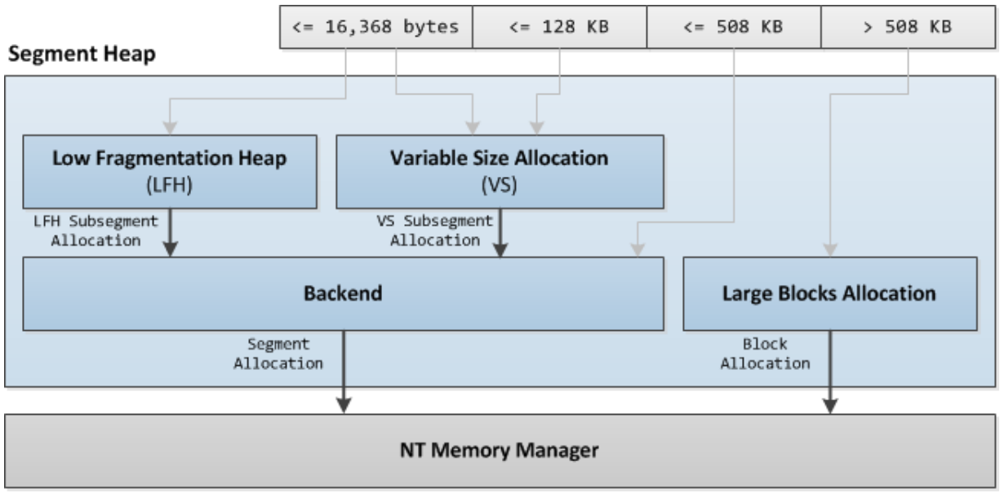
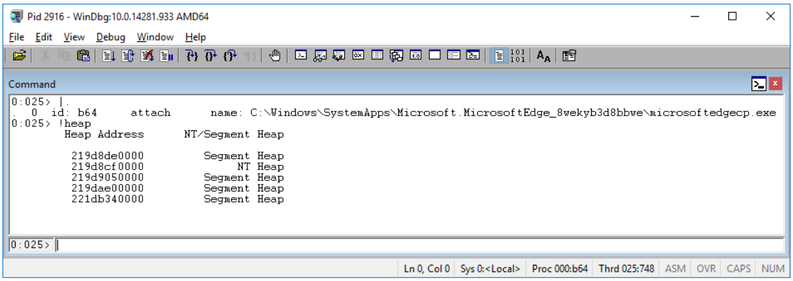
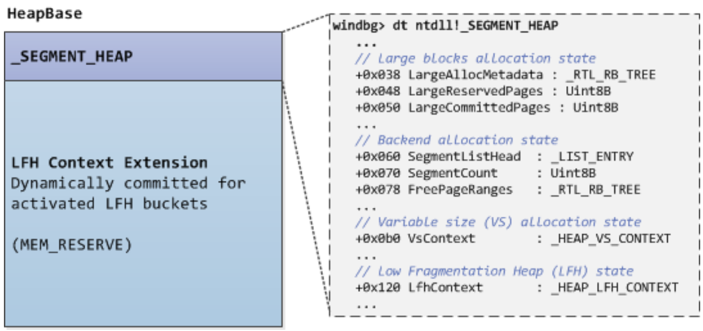
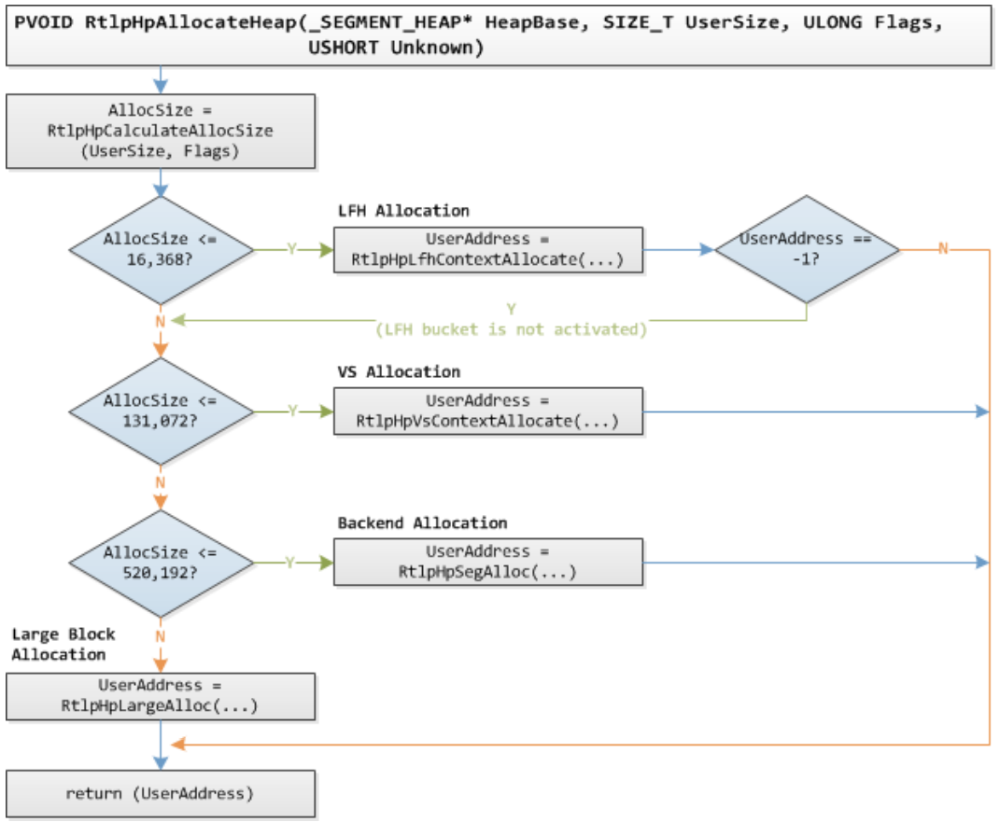
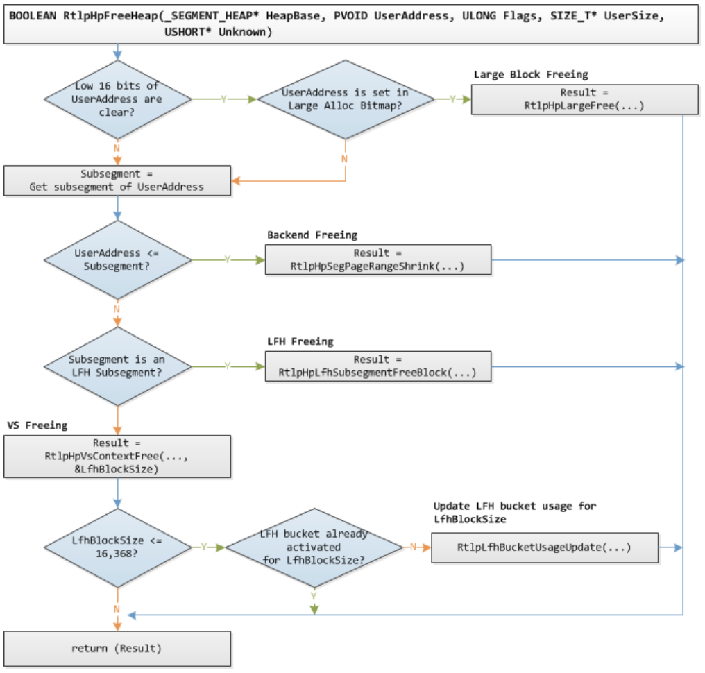
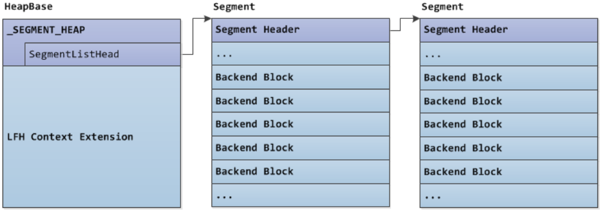
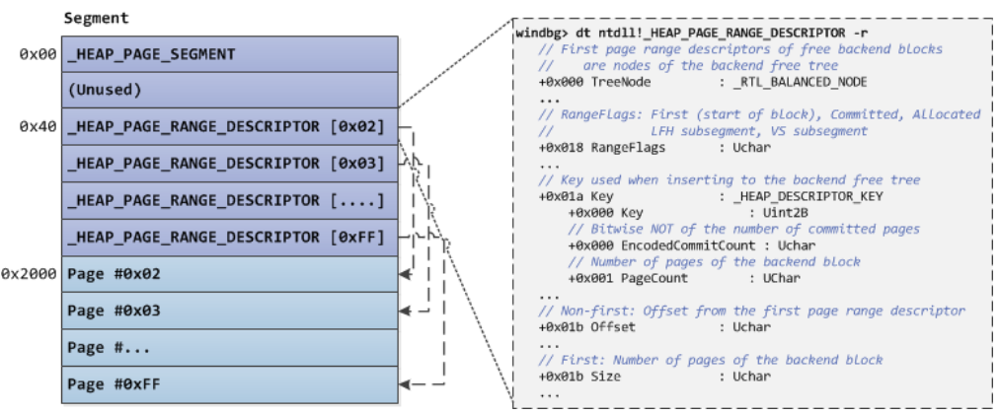
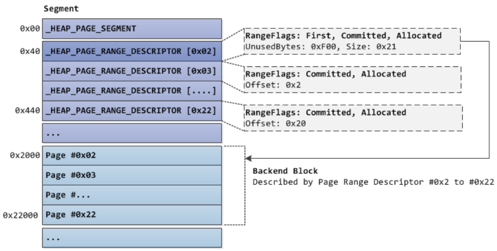
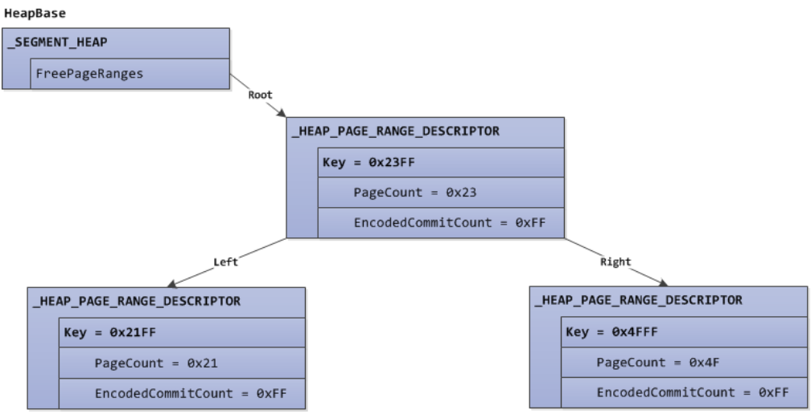
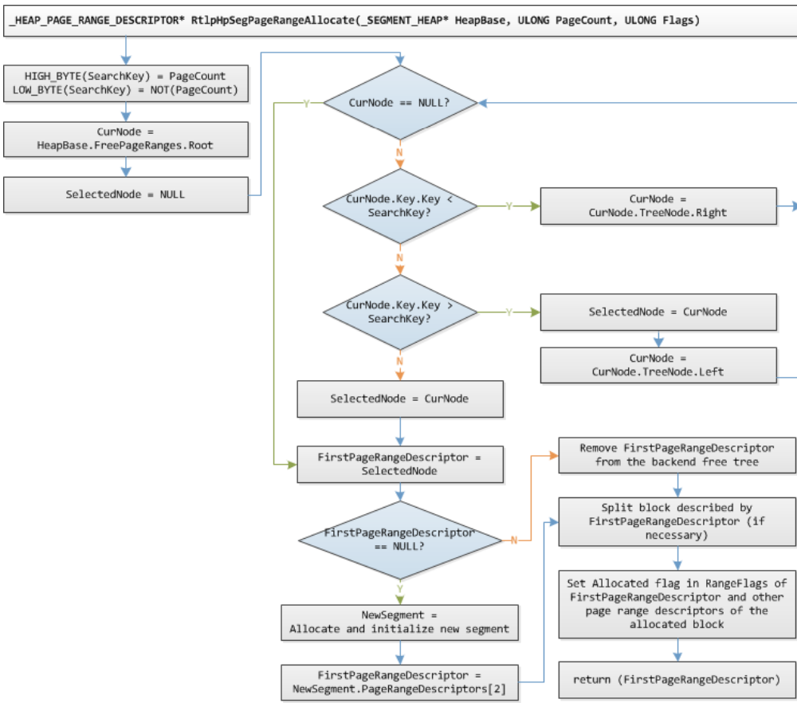

WINDOWS 10 SEGMENT HEAP INTERNALS
-

# ABSTRACT
Được ra mắt trong Windows 10, Segment Heap triển khai native heap được sử dụng trong các ứng dụng Windows (trước đây được gọi là Modern/Metro apps) và các tiến trình hệ thống nhất định. Việc triển khai heap mới này là một sự bổ sung được nghiên cứu kỹ lưỡng và được tài liệu hóa rộng rãi để NT Heap vẫn được sử dụng trong các ứng dụng truyền thống và trong các loại phân bổ nhất định trong các ứng dụng Windows.

Một khía cạnh quan trọng của Segment Heap là nó được thiết lập cho Microsoft Edge, có nghĩa là các components/dependencies chạy trong Edge không sử dụng trình quản lý heap tùy chỉnh mà sẽ sử dụng Segment Heap. Do đó, việc khai thác các lỗ hổng memory corruption đáng tin cậy trong các components/dependencies Edge này sẽ yêu cầu một số mức độ hiểu biết về Segment Heap.

Trong phần trình bày này, tôi sẽ thảo luận về cấu trúc dữ liệu, thuật toán và cơ chế bảo mật của Segment Heap. Kiến thức về Segment Heap cũng được áp dụng bằng cách thảo luận và chứng minh cách lỗ hổng memory corruption trong thư viện Microsoft WinRT PDF (CVE-2016-0117) được tận dụng để ghi tùy ý trong phần sau của nội dung tiến trình Edge.

# CONTENTS
1. Introduction
2. Internals
    * 2.1 Overview 
      - Architecture
      - Defaults and Configuration
      - Heap Creation
      - HeapBase and _SEGMENT_HEAP Structure
      - Block Allocation 
      - Block Freeing 
    * 2.2. Backend Allocation
      - Segment Structure
      - _HEAP_PAGE_SEGMENT Structure
      - _HEAP_PAGE_RANGE_DESCRIPTOR Structure
      - Backend Free Tree 
      - Backend Allocation 
      - Backend Freeing 
    * 2.3. Variable Size Allocation
      - VS Subsegments
      - _HEAP_VS_CONTEXT Structure 
      - _HEAP_VS_SUBSEGMENT Structure
      - _HEAP_VS_CHUNK_HEADER Structure
      - _HEAP_VS_CHUNK_FREE_HEADER Structure
      - VS Free Tree
      - VS Allocation
      - VS Freeing
    * 2.4. Low Fragmentation Heap
      - LFH Subsegments
      - _HEAP_LFH_CONTEXT Structure
      - _HEAP_LFH_ONDEMAND_POINTER Structure.
      - _HEAP_LFH_BUCKET Structure
      - _HEAP_LFH_AFFINITY_SLOT Structure 
      - _HEAP_LFH_SUBSEGMENT_OWNER Structure 
      - _HEAP_LFH_SUBSEGMENT Structure
      - LFH Block Bitmap 
      - LFH Bucket Activation
      - LFH Allocation
      - LFH Freeing 
    * 2.5. Large Blocks Allocation 
      - _HEAP_LARGE_ALLOC_DATA Structure
      - Large Block Allocation
      - Large Block Freeing
    * 2.6. Block Padding
    * 2.7. Summary and Analysis: Internals
3. Security Mechanisms
    * 3.1. Fast Fail on Linked List Node Corruption
    * 3.2. Fast Fail on RB Tree Node Corruption
    * 3.3. Heap Address Randomization
    * 3.4. Guard Pages 
    * 3.5. Function Pointer Encoding 
    * 3.6. VS Block Header Encoding
    * 3.7. LFH Subsegment BlockOffsets Encoding
    * 3.8. LFH Allocation Randomization
    * 3.9. Summary and Analysis: Security Mechanisms
4. Case Study
    * 4.1. CVE-2016-0117 Vulnerability Details 
    * 4.2. Plan for Implanting the Target Address
    * 4.3. Manipulating the MSVCRT Heap with Chakra’s ArrayBuffer 
      - Allocation and Setting Controlled Values
      - LFH Bucket Activation
      - Freeing and Garbage Collection 
    * 4.4. Preventing Target Address Corruption
    * 4.5. Preventing Free Blocks Coalescing
    * 4.6. Preventing Unintended Use of Free Blocks
    * 4.7. Adjusted Plan for Implanting the Target Address
    * 4.8. Successful Arbitrary Write
    * 4.9. Analysis and Summary: Case Study
5. Conclusion
6. Appendix: WinDbg !heap Extension Commands for Segment Heap
    * !heap -x <address>
    * !heap -i <address> -h <heap>
    * !heap -s -a -h <heap>
7. Bibliography
  
## 1. INTRODUCTION
Với sự ra đời của Windows 10, Segment Heap, một triển khai native heap mới cũng được giới thiệu. Nó hiện là triển khai native heap được sử dụng trong các ứng dụng Windows (trước đây được gọi là Modern/Metro apps) và trong các tiến trình hệ thống nhất định, các ứng dụng truyền thống thì mặc định vẫn triển khai native heap cũ hơn (NT Heap).

Từ quan điểm của nhà nghiên cứu bảo mật, việc hiểu rõ internals của Segment Heap là rất quan trọng vì những kẻ tấn công có thể tận dụng hoặc khai thác các thành phần mới và quan trọng này trong tương lai gần, đặc biệt là vì nó đang được sử dụng bởi trình duyệt Edge. Ngoài ra, một nhà nghiên cứu bảo mật thực hiện kiểm tra phần mềm có thể cần phải phát triển một proof of concept (POC - bằng chứng về khái niệm) cho một lỗ hổng để chứng minh khả năng khai thác vendor/developer. Nếu việc tạo bằng chứng của khái niệm (POC) yêu cầu thao tác chính xác đối với một heap được quản lý bởi Segment Heap, thì sự hiểu biết về internals của nó chắc chắn sẽ hữu ích. Bài viết này nhằm giúp người đọc hiểu sâu sắc về Segment Heap.

Bài viết được chia làm ba phần chính. Phần thứ nhất (Internals) sẽ bàn luận sâu về các component (thành phần) khác nhau của Segment Heap. Nó bao gồm các cấu trúc dữ liệu và thuật toán được sử dụng bởi mỗi Segment Heap component khi thực hiện các chức năng của chúng. Phần thứ hai (Security Mechanisms) sẽ bàn luận về các cơ chế khác nhau khiến việc tấn công Segment Heap metadata quan trọng trở nên khó khăn hoặc không thể tin cậy và trong một số trường hợp nhất định, gây khó khăn cho việc thực hiện thao tác bố trí heap chính xác. Phần thứ ba (Case Study) là nơi áp dụng sự hiểu biết về Segment Heap bằng cách thảo luận về các phương pháp để điều khiển việc bố trí heap được quản lý bởi Segment để tận dụng lỗ hổng ghi tùy ý.

Vì Segment Heap và NT Heap chia sẻ các khái niệm tương tự nhau, người đọc được khuyến khích đọc các tác phẩm trước đây thảo luận về Internals của NT Heap [1, 2, 3, 4, 5]. Các công trình trước đây và các bài báo/bài thuyết trình khác nhau mà họ tham khảo cũng thảo luận về các cơ chế bảo mật và kỹ thuật tấn công cho NT Heap sẽ cung cấp cho người đọc ý tưởng tại sao các cơ chế bảo mật heap nhất định lại được sử dụng trong Segment Heap

Tất cả các thông tin trong bài viết này dưa trên NTDLL.DLL (64-bit) phiên bản 10.0.14295.1000 từ Windows 10 Redstone 1 Preview (Build 14295).

## 2. INTERNALS
Trong phần này, sẽ bàn sâu về internals của Segment Heap. Đầu tiên sẽ là tổng quan về các thành phần khác nhau của Segment Heap và sau đó mô tả các trường hợp khi Segment Heap được kích hoạt. Sau phần tổng quan, mỗi thành phần Segment Heap sẽ được thảo luận chi tiết trong phần phụ của riêng chúng.

Lưu ý rằng. internal NTDLL functions được bàn luận ở đây có thể được nêu trong một số bản dựng NTDLL. Do đó, các internal functions có thể không được nhìn thấy trong danh sách các functions trong IDA và bản sao của các function có thể được nhúng/gắn vào trong các functions khác.

### 2.1. OVERVIEW
**Architecture**

Segment Heap bao gồm bốn components (thành phần): (1) Backend, phân bổ các heap block có kích thước > 128KB và <= 508KB. Nó sử dụng các virtual memory functions do NT Memory Manager cung cấp để tạo và quản lý các segment ở nơi các backend block được cấp phát từ đó. (2) Thành phần phân bổ variable size (VS) cho các yêu cầu cấp phát kích thước <= 128KB. Nó sử dụng backend để tạo các VS subsegments ở nơi các VS block được cấp phát từ đó. (3) Low Fragmentation Heap (LFH) cho các yêu cầu cấp phát có kích thước <= 16.368 byte nhưng chỉ khi kích thước phân bổ được phát hiện là thường được sử dụng trong việc cấp phát. Nó sử dụng backend để tạo các phân đoạn LFH subsegments nơi các LFH block được cấp phát từ dó. (4) Sử dụng để phân bổ các block > 508KB. Nó sử dụng các chức năng bộ nhớ ảo do NT Memory Manager cung cấp để phân bổ và giải phóng các khối lớn. Nó sử dụng virtual memory functions cho việc cấp phát và giải phóng các block lớn.



**Defaults and Configuration**

Segment Heap hiện là một tính năng tự lựa chọn tham gia. Các ứng dụng Windows được chọn tham gia theo mặc định và các tệp thực thi có tên khớp với bất kỳ tên nào sau đây (tên của tệp thực thi hệ thống) cũng được chọn tham gia theo mặc định để sử dụng Segment Heap:
- csrss.exe
- lsass.exe
- runtimebroker.exe
- services.exe
- smss.exe
- svchost.exe

Để bật hoặc tắt Segment Heap cho một tệp thực thi cụ thể, có thể Image File Execution Options (IFEO) thiết lập registry entry như sau:
``` 
HKEY_LOCAL_MACHINE\SOFTWARE\Microsoft\Windows NT\CurrentVersion\
Image File Execution Options\(executable)
FrontEndHeapDebugOptions = (DWORD)
Bit 2 (0x04): Disable Segment Heap
Bit 3 (0x08): Enable Segment Heap
```

Để bật hoặc tắt Segment Heap cho toàn bộ file thực thi, có thể thiết lập registry entry như sau:
```
HKEY_LOCAL_MACHINE\SYSTEM\CurrentControlSet\Control\Session Manager\Segment Heap
Enabled = (DWORD)
0 : Disable Segment Heap
(Not 0): Enable Segment Heap
```

Nếu sau tất cả các lần kiểm tra, nó được xác định rằng một quá trình sẽ sử dụng Segment Heap, bit 0 của biến toàn cục RtlpHpHeapFeatures sẽ được đặt.

Lưu ý rằng ngay cả khi Segment Heap được bật trong một tiến trình, không phải tất cả các heap được tạo bởi tiến trình đó sẽ được quản lý bởi Segment Heap vì có những loại heap đặc biệt vẫn cần được quản lý bởi NT Heap (điều này sẽ được thảo luận trong mục con tiếp theo).

**Heap Creation**

Nếu Segment Heap được thiết lập (bit 0 của RtlpHpHeapFeatures được set), heap được tạo bởi [HeapCreate()](https://docs.microsoft.com/en-us/windows/win32/api/heapapi/nf-heapapi-heapcreate) sẽ được quản lý bởi Segment Heap ngoại trừ đối số dwMaximumSize được truyền vào nó không phải là 0 (heap không thể phát triển kích thước)

Nếu [RtlCreateHeap()](https://docs.microsoft.com/en-us/windows-hardware/drivers/ddi/ntifs/nf-ntifs-rtlcreateheap) API được sử dụng trực tiếp để tạo heap, tất cả các điều sau đây phải đúng đối với Segment Heap để quản lý heap được tạo:
   - Heap phải có thể phát triển: Đối số Flags được truyền vào hàm RtlCreateHeap() phải là HEAP_GROWABLE.
   - Bộ nhớ heap không nên được cấp phát trước (đề xuất một heap được chia sẻ): Đối số HeapBase được truyền đến RtlCreateHeap() phải là NULL.
   - Nếu đối số Parameters được truyền đến RtlCreateHeap(), các trường Parameters sau đây phải được đặt thành 0/NULL: SegmentReserve, SegmentCommit, VirtualMemoryThreshold and CommitRoutine.
   - Đối số Lock được truyền vào hàm RtlCreateHeap() phải là NULL.
   
Hình minh họa sau đây sẽ cho thấy heap được tạo khi nội dung tiến trình Edge (một app của Windows) được load lần đầu:



Bốn trên năm heap được quản lý bởi Segment Heap. Heap đầu tiên là tiến trình heap mặc định, và heap thứ ba là MSVCRT heap (msvcrt!crtheap). Heap thứ hai là một shared heap (ntdll!CsrPortHeap) nên nó được quản lý bởi NT Heap.

**HeapBase and _SEGMENT_HEAP Structure**

Khi một heap được quản lý bởi Segment Heap được tạo, address/handle heap (gọi chung là HeapBase) được trả về bởi HeapCreate() hoặc RtlCreateHeap() sẽ trỏ đến một cấu trúc _SEGMENT_HEAP (bản sao cấu trúc _HEAP của NT Heap).

HeapBase là vị trí trung tâm, lưu trữ trạng thái của các components Segment Heap khác nhau, nó có các trường sau:
```
windbg> dt ntdll!_SEGMENT_HEAP
   +0x000 TotalReservedPages : Uint8B
   +0x008 TotalCommittedPages : Uint8B
   +0x010 Signature : Uint4B
   +0x014 GlobalFlags : Uint4B
   +0x018 FreeCommittedPages : Uint8B
   +0x020 Interceptor : Uint4B
   +0x024 ProcessHeapListIndex : Uint2B
   +0x026 GlobalLockCount : Uint2B
   +0x028 GlobalLockOwner : Uint4B
   +0x030 LargeMetadataLock : _RTL_SRWLOCK
   +0x038 LargeAllocMetadata : _RTL_RB_TREE
   +0x048 LargeReservedPages : Uint8B
   +0x050 LargeCommittedPages : Uint8B
   +0x058 SegmentAllocatorLock : _RTL_SRWLOCK
   +0x060 SegmentListHead : _LIST_ENTRY
   +0x070 SegmentCount : Uint8B
   +0x078 FreePageRanges : _RTL_RB_TREE
   +0x088 StackTraceInitVar : _RTL_RUN_ONCE
   +0x090 ContextExtendLock : _RTL_SRWLOCK
   +0x098 AllocatedBase : Ptr64 UChar
   +0x0a0 UncommittedBase : Ptr64 UChar
   +0x0a8 ReservedLimit : Ptr64 UChar
   +0x0b0 VsContext : _HEAP_VS_CONTEXT
   +0x120 LfhContext : _HEAP_LFH_CONTEXT
 ```
 
   - Signature - 0xDDEEDDEE (Heap được tạo bởi Segment Heap)
   
Các trường để theo dõi trạng thái phân bổ block lớn (ở phần 2.5 ta sẽ nói thêm):
   - LargeAllocMetadata - Red-black tree (RB tree) của large blocks metadata.
   - LargeReservedPages - Số trang được dành riêng cho tất cả large blocks allocation.
   - LargeCommittedPages - Số trang được commit cho tất cả large blocks allocation.

Các trường để theo dõi trạng thái phân bộ backend (ở phần 2.2 ta sẽ nói thêm):
   - SegmentCount - Số lượng segment thuộc sở hữu bởi heap.
   - SegmentListHead - Danh sách liên kết của các segment thuộc sở hưu của heap.
   - FreePageRanges - RB tree của free backend blocks.
   
Cấu trúc con sau theo dõi trạng thái của sự thay đổi kích thước phần bổ và trạng thái của Low Fragmentation Heap:
   - VsContext - Theo dõi trạng thái của sự thay đổi kích thước phần bổ (xem thêm ở phần 2.3).
   - LfhContext - Theo dõi trạng thái của Low Fragmentation Heap (xem thêm ở phần 2.4).
   
Heap được cấp phát và khởi tạo thông qua lệnh gọi hàm RtlpHpSegHeapCreate(). NtAllocateVirtualMemory () được sử dụng để reverse và commit bộ nhớ ảo cho heap. Kích thước reverse thay đổi tùy thuộc vào số lượng bộ xử lý và kích thước commit là kích thước của cấu trúc _SEGMENT_HEAP.

Phần còn lại của bộ nhớ reverse dưới cấu trúc _SEGMENT_HEAP được gọi là LFH context extension và nó được dynamically commited để lưu trữ cấu trúc dữ liệu cần thiết cho các LFH bucket đã được kích hoạt.



**Block Allocation**

Khi cấp phát một block thông qua HeapAlloc() hoặc RtlAllocateHeap(), hàm RtlpHpAllocateHeap() sẽ được gọi cuối cùng để thực hiện yêu cầu cấp phát nếu heap được quản lý bởi Segment Heap

RtlpHpAllocateHeap() có các đối số sau:
```
PVOID RtlpHpAllocateHeap(_SEGMENT_HEAP* HeapBase, SIZE_T UserSize, ULONG Flags, USHORT Unknown)
```

Trong đó UserSize (kích thước do người dùng yêu cầu) là kích thước được truyền vào hàm HeapAlloc() hoặc RtlAllocateHeap(). Giá trị trả về là con trỏ đến block mới được cấp phát (được gọi là UserAddress).

Sơ đồ sau miêu tả logic của RtlpHpAllocateHeap():



Mục đích của RtlpHpAllocateHeap là gọi hàm cấp phát Segment Heap component thích hợp dựa trên AllocSize. AllocSize (kích thước phân bổ) là UserSize được điều chỉnh tùy thuộc vào Flags, nhưng theo mặc định, AllocSize sẽ bằng UserSize trừ khi UserSize là 0 (nếu UserSize là 0, AllocSize sẽ là 1).

Lưu ý rằng việc AllocSize được kiểm tra thực sự nằm trong hàm RtlpHpAllocateHeapInternal(). Ngoài ra, cần lưu ý là nếu phân bổ LFH trả về -1, điều đó có nghĩa là LFH bucket tương ứng với AllocSize chưa được kích hoạt và do đó, yêu cầu cấp phát cuối cùng sẽ được chuyển đến components cấp phát VS.

**Block Freeing**

Khi giải phóng một block thông qua HeapFree() hoặc RtlFreeHeap(), hàm RtlpHpFreeHeap() sẽ được gọi cuối cùng để thực hiện yêu cầu nếu heap được quản lý bởi Segment Heap.

RtlpHpFreeHeap() có các đối số sau:
```
BOOLEAN RtlpHpFreeHeap(_SEGMENT_HEAP* HeapBase, PVOID UserAddress, ULONG Flags,
 SIZE_T* UserSize, USHORT* Unknown)
```

Trong đó UserAddress là địa chỉ của block được trả về bởi HeapAlloc() hoặc RtlAllocateHeap() và UserSize sẽ là kích thước do người dùng yêu cầu của block được giải phóng.

Sơ đồ bên dưới miêu tả logic của việc giải phóng của hàm RtlpHpFreeHeap():



Mục đích của RtlpHpFreeHeap() là gọi hàm giải phóng của Segment Heap component thích hợp dựa trên giá trị của UserAddress và loại subsegment của nó. Các subsegment sẽ được thảo luận thêm ở phần sau của bài viết này, ở đây ta cần biết, các subsegment là các loại backend block đặc biệt, nơi các block VS và LFH được cấp phát từ đó.

Vì địa chỉ của các phân bổ lớn được căn chỉnh thành 64KB, một UserAddress với 16 bit thấp được clear sẽ được kiểm tra đầu tiên dựa trên large allocation bitmap. Nếu UserAddress (thực sự là UserAddress >> 16) được đặt trong large allocation bitmap, large block freeing được gọi.

Tiếp theo, subsegment nơi UserAddress được xác định. Nếu UserAddress nhỏ hơn hoặc bằng resulting địa chỉ của subsegment, điều đó có nghĩa là UserAddress dành cho backend block, vì địa chỉ của VS block và LFH block nằm trên địa chỉ subsegment do các header của VS/LFH subsegment được đặt trước các VS/LFH block. Nếu UserAddress trỏ đến một backend block, backend freeing được gọi.

Cuối cùng, nếu subsegment là một LFH subsegment, LFH freeing được gọi. Ngược lại, VS freeing được gọi. Nếu VS freeing được gọi và nếu LfhBlockSize được trả về (tương đương block size của VS block được giải phóng trừ đi 0x10) có thê được sử dụng bởi LFH, bộ đếm sử dụng của LFH bucket tương ứng với LfhBlockSize sẽ được cập nhật.

Lưu ý rằng logic kiểm tra subsegment của UserAddress thực sự nằm trong hàm RtlpHpSegFree(). Ngoài ra, sơ đồ chỉ hiển thị logic giải phóng của RtlpHpFreeHeap(), các chức năng khác của nó không được bao gồm.

### 2.2. BACKEND ALLOCATION 
Backend được sử dụng để phân bổ kích thước từ 131073 (0x20001) đến 520192 (0x7F000). Các backend block có mức độ chi tiết về kích thước trang và mỗi block không có block header ở đầu. Ngoài việc phân bổ các back end block, backend cũng được sử dụng bởi component VS và LFH để tạo các subsegment VS/LFH (các loại backend block đặc biệt) nơi các block VS/LFH được phân bổ.

**Segment Structure** 

Backend hoạt động trên cấu trúc segment là các block virtual memory 1MB (0x100000) được cấp phát thông qua hàm NtAllocateVirtualMemory(). Các segment được theo dõi thông qua trường SegmentListHead trong HeapBase:



2000 bytes đầu tiên của một segment được sử dụng cho segment header, trong khi phần còn lại được sử dụng để phân bổ các backend block. Ban đầu, 0x2000 bytes đầu tiên cộng với kích thước commit ban đầu của segment được commit, trong khi phần còn lại ở trạng thái reserver và được commit và decommit khi cần thiết.

Segment header bao gồm một mảng 256 bộ mô tả phạm vị trang được dùng để mô tả trạng thái của từng trang trong segment. Vì phần dữ liệu của segment bắt đầu tại offset 0x2000,  page range descriptor đầu tiên được định vị lại để lưu trữ cấu trúc _HEAP_PAGE_SEGMENT, trong khi page range descriptor thứ hai không được sử dụng.

**_HEAP_PAGE_SEGMENT Structure**

Như đề cập ở trên, page range descriptor đầu tiên được định vị lại để lưu trữ cấu trúc _HEAP_PAGE_SEGMENT. Nó có các trường sau:
```
windbg> dt ntdll!_HEAP_PAGE_SEGMENT
   +0x000 ListEntry : _LIST_ENTRY
   +0x010 Signature : Uint8B
 ```
   - ListEntry - Mỗi segment là một node của danh sách liên kết các segment của heap (HeapBase.SegmentListHead).
   - Signature - Được sử dụng để xác minh nếu một địa chỉ là một phần của một segment. Trường này được tính theo công thức sau: (SegmentAddress >> 0x14) ^ RtlpHeapKey ^ HeapBase ^ 0xA2E64EADA2E64EAD.

**_HEAP_PAGE_RANGE_DESCRIPTOR Structure**

Cũng được đề cập là các page range descriptor để mô tả trạng thái của từng trang trong segment. Vì backend block có thể kéo dài nhiều trang (một phạm vi trang), page range descriptor cho trang đầu tiên của backend block được đánh dấu là "first" và do đó, sẽ có các trường bổ sung được set.
```
windbg> dt ntdll!_HEAP_PAGE_RANGE_DESCRIPTOR -r
   +0x000 TreeNode : _RTL_BALANCED_NODE
   +0x000 TreeSignature : Uint4B
   +0x004 ExtraPresent : Pos 0, 1 Bit
   +0x004 Spare0 : Pos 1, 15 Bits
   +0x006 UnusedBytes : Uint2B
   +0x018 RangeFlags : UChar
   +0x019 Spare1 : UChar
   +0x01a Key : _HEAP_DESCRIPTOR_KEY
      +0x000 Key : Uint2B
      +0x000 EncodedCommitCount : UChar
      +0x001 PageCount : UChar
   +0x01a Align : UChar
   +0x01b Offset : UChar
   +0x01b Size : UChar
 ```
   - TreeNode - "first" page range descriptor của các free backend block là các node của backend free tree (HeapBase.FreePageRanges)
   - UnusedBytes - Dành cho "first" page range descriptor. Sự khác biệt giữa UserSize và block size.
   - RangeFlags - Trường bit đại diện cho loại backend block và trạng thái của trang được đại diện bởi page range descriptor.
      - 0x01: PAGE_RANGE_FLAGS_LFH_SUBSEGMENT. Dành cho "first" page range descriptor. Backend block là một LFH subsegment.
      - 0x02: PAGE_RANGE_FLAGS_COMMITED. Page được commit.
      - 0x04: PAGE_RANGE_FLAGS_ALLOCATED. Page được allocate/busy.
      - 0x08: PAGE_RANGE_FLAGS_FIRST. Page range descriptor được đánh dấu là "first".
      - 0x20: PAGE_RANGE_FLAGS_VS_SUBSEGMENT. Dành cho "first" page range descriptor. Backend block là một VS subsegment.
   - Key - Dành cho "first" page range descriptor của free backend blocks. Nó được sử dụng khi một free backend block được chèn vào backend free tree
      - Key - Key với kích thước WORD được sử dụng cho backend free tree. Byte cao là trường PageCount và byte thấp là trường EncodedCommitCount(xem thêm bên dưới).
      - EncodedCommitCount - Bitwise NOT của số trang được commit của backend block. Số lượng các trang được commit mà kfree backend block có càng lớn, thì EncodedCommitCount sẽ thấp hơn.
      - PageCount - Số trang của backend block.
   - Offset - Dành cho non-"first" page range descriptors. Offset (độ chênh lệch) của page range descriptor từ "first" page range descriptor
   - Size - Dành cho "first" page range descriptors. Như Key.PageCount (overlapping fields).

Dưới đây là hình ảnh minh họa của một segment:



Và dưới đây là hình ảnh minh họa của một backend block 131328 (0x20100) bytes busy và page range descriptor tương ứng ("first" page range descriptor sẽ được highlight):



Lưu ý rằng vì các page range descriptor mô tả các backend block được lưu trữ ở đầu segment, điều đó có nghĩa là mỗi backend block không có block header ở đầu.

**Backend Free Tree**

Backend allocation và freeing sử dụng backend free tree để tìm và lưu trữ thông tin về các free backend block.

Gốc của backend free tree được lưu trữ trong HeapBase.FreePageRanges và các node trên cây là các "first" page range descriptor của các free backend block. Key được sử dụng để chèn các node trong backend free tree là trường Key.Key của "first" page range descriptor (xem chi tiết về Key.Key ở phần trước).

Hình ảnh minh họa bên dưới là một backend free tree, trong đó có ba free backend block với kích thước lần lượt là 0x21000, 0x23000 và 0x4F000 (tất cả oage của free block đều được decommit - Key.EncodedCommitCount là 0xFF): 



**Backend Allocation**

Backend allocation được thực hiện thông qua hàm RtlpHpSegAlloc(), gồm các đối số như sau:
```
PVOID RtlpHpSegAlloc(_SEGMENT_HEAP* HeapBase, SIZE_T UserSize, SIZE_T AllocSize, ULONG Flags)
```
Hàm RtlpHpSegAlloc() gọi RtlpHpSegPageRangeAllocate() đầu tiên để phân bổ một backend block. Mặt khác, RtlpHpSegPageRangeAllocate() chấp nhận số lượng trang để phân bổ và trả về “first” page range descriptor của backend block được phân bổ. Sau đó, RtlpHpSegAlloc() chuyển đổi “first” page range descriptor được trả về thành địa chỉ backend block thực tế (UserAddress) làm giá trị trả về của nó.

Sơ đồ bên dưới miêu tả logic của hàm RtlpHpSegPageRangeAllocate():




