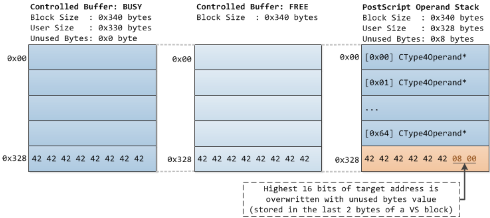

WINDOWS 10 SEGMENT HEAP INTERNALS
-

# ABSTRACT
Được ra mắt trong Windows 10, Segment Heap triển khai native heap được sử dụng trong các ứng dụng Windows (trước đây được gọi là Modern/Metro apps) và các tiến trình hệ thống nhất định. Việc triển khai heap mới này là một sự bổ sung được nghiên cứu kỹ lưỡng và được tài liệu hóa rộng rãi để NT Heap vẫn được sử dụng trong các ứng dụng truyền thống và trong các loại phân bổ nhất định trong các ứng dụng Windows.

Một khía cạnh quan trọng của Segment Heap là nó được thiết lập cho Microsoft Edge, có nghĩa là các components/dependencies chạy trong Edge không sử dụng trình quản lý heap tùy chỉnh mà sẽ sử dụng Segment Heap. Do đó, việc khai thác các lỗ hổng memory corruption đáng tin cậy trong các components/dependencies Edge này sẽ yêu cầu một số mức độ hiểu biết về Segment Heap.

Trong phần trình bày này, tôi sẽ thảo luận về cấu trúc dữ liệu, thuật toán và cơ chế bảo mật của Segment Heap. Kiến thức về Segment Heap cũng được áp dụng bằng cách thảo luận và chứng minh cách lỗ hổng memory corruption trong thư viện Microsoft WinRT PDF (CVE-2016-0117) được tận dụng để ghi tùy ý trong phần sau của nội dung tiến trình Edge.

# CONTENTS
1. Introduction
2. Internals
    * 2.1 Overview 
      - Architecture
      - Defaults and Configuration
      - Heap Creation
      - HeapBase and _SEGMENT_HEAP Structure
      - Block Allocation 
      - Block Freeing 
    * 2.2. Backend Allocation
      - Segment Structure
      - _HEAP_PAGE_SEGMENT Structure
      - _HEAP_PAGE_RANGE_DESCRIPTOR Structure
      - Backend Free Tree 
      - Backend Allocation 
      - Backend Freeing 
    * 2.3. Variable Size Allocation
      - VS Subsegments
      - _HEAP_VS_CONTEXT Structure 
      - _HEAP_VS_SUBSEGMENT Structure
      - _HEAP_VS_CHUNK_HEADER Structure
      - _HEAP_VS_CHUNK_FREE_HEADER Structure
      - VS Free Tree
      - VS Allocation
      - VS Freeing
    * 2.4. Low Fragmentation Heap
      - LFH Subsegments
      - _HEAP_LFH_CONTEXT Structure
      - _HEAP_LFH_ONDEMAND_POINTER Structure.
      - _HEAP_LFH_BUCKET Structure
      - _HEAP_LFH_AFFINITY_SLOT Structure 
      - _HEAP_LFH_SUBSEGMENT_OWNER Structure 
      - _HEAP_LFH_SUBSEGMENT Structure
      - LFH Block Bitmap 
      - LFH Bucket Activation
      - LFH Allocation
      - LFH Freeing 
    * 2.5. Large Blocks Allocation 
      - _HEAP_LARGE_ALLOC_DATA Structure
      - Large Block Allocation
      - Large Block Freeing
    * 2.6. Block Padding
    * 2.7. Summary and Analysis: Internals
3. Security Mechanisms
    * 3.1. Fast Fail on Linked List Node Corruption
    * 3.2. Fast Fail on RB Tree Node Corruption
    * 3.3. Heap Address Randomization
    * 3.4. Guard Pages 
    * 3.5. Function Pointer Encoding 
    * 3.6. VS Block Header Encoding
    * 3.7. LFH Subsegment BlockOffsets Encoding
    * 3.8. LFH Allocation Randomization
    * 3.9. Summary and Analysis: Security Mechanisms
4. Case Study
    * 4.1. CVE-2016-0117 Vulnerability Details 
    * 4.2. Plan for Implanting the Target Address
    * 4.3. Manipulating the MSVCRT Heap with Chakra’s ArrayBuffer 
      - Allocation and Setting Controlled Values
      - LFH Bucket Activation
      - Freeing and Garbage Collection 
    * 4.4. Preventing Target Address Corruption
    * 4.5. Preventing Free Blocks Coalescing
    * 4.6. Preventing Unintended Use of Free Blocks
    * 4.7. Adjusted Plan for Implanting the Target Address
    * 4.8. Successful Arbitrary Write
    * 4.9. Analysis and Summary: Case Study
5. Conclusion
6. Appendix: WinDbg !heap Extension Commands for Segment Heap
    * !heap -x <address>
    * !heap -i <address> -h <heap>
    * !heap -s -a -h <heap>
  
## 1. INTRODUCTION
Với sự ra đời của Windows 10, Segment Heap, một triển khai native heap mới cũng được giới thiệu. Nó hiện là triển khai native heap được sử dụng trong các ứng dụng Windows (trước đây được gọi là Modern/Metro apps) và trong các tiến trình hệ thống nhất định, các ứng dụng truyền thống thì mặc định vẫn triển khai native heap cũ hơn (NT Heap).

Từ quan điểm của nhà nghiên cứu bảo mật, việc hiểu rõ internals của Segment Heap là rất quan trọng vì những kẻ tấn công có thể tận dụng hoặc khai thác các thành phần mới và quan trọng này trong tương lai gần, đặc biệt là vì nó đang được sử dụng bởi trình duyệt Edge. Ngoài ra, một nhà nghiên cứu bảo mật thực hiện kiểm tra phần mềm có thể cần phải phát triển một proof of concept (POC - bằng chứng về khái niệm) cho một lỗ hổng để chứng minh khả năng khai thác vendor/developer. Nếu việc tạo bằng chứng của khái niệm (POC) yêu cầu thao tác chính xác đối với một heap được quản lý bởi Segment Heap, thì sự hiểu biết về internals của nó chắc chắn sẽ hữu ích. Bài viết này nhằm giúp người đọc hiểu sâu sắc về Segment Heap.

Bài viết được chia làm ba phần chính. Phần thứ nhất (Internals) sẽ bàn luận sâu về các component (thành phần) khác nhau của Segment Heap. Nó bao gồm các cấu trúc dữ liệu và thuật toán được sử dụng bởi mỗi Segment Heap component khi thực hiện các chức năng của chúng. Phần thứ hai (Security Mechanisms) sẽ bàn luận về các cơ chế khác nhau khiến việc tấn công Segment Heap metadata quan trọng trở nên khó khăn hoặc không thể tin cậy và trong một số trường hợp nhất định, gây khó khăn cho việc thực hiện thao tác bố trí heap chính xác. Phần thứ ba (Case Study) là nơi áp dụng sự hiểu biết về Segment Heap bằng cách thảo luận về các phương pháp để điều khiển việc bố trí heap được quản lý bởi Segment để tận dụng lỗ hổng ghi tùy ý.

Vì Segment Heap và NT Heap chia sẻ các khái niệm tương tự nhau, người đọc được khuyến khích đọc các tác phẩm trước đây thảo luận về Internals của NT Heap [1, 2, 3, 4, 5]. Các công trình trước đây và các bài báo/bài thuyết trình khác nhau mà họ tham khảo cũng thảo luận về các cơ chế bảo mật và kỹ thuật tấn công cho NT Heap sẽ cung cấp cho người đọc ý tưởng tại sao các cơ chế bảo mật heap nhất định lại được sử dụng trong Segment Heap

Tất cả các thông tin trong bài viết này dưa trên NTDLL.DLL (64-bit) phiên bản 10.0.14295.1000 từ Windows 10 Redstone 1 Preview (Build 14295).

## 2. INTERNALS
Trong phần này, sẽ bàn sâu về internals của Segment Heap. Đầu tiên sẽ là tổng quan về các thành phần khác nhau của Segment Heap và sau đó mô tả các trường hợp khi Segment Heap được kích hoạt. Sau phần tổng quan, mỗi thành phần Segment Heap sẽ được thảo luận chi tiết trong phần phụ của riêng chúng.

Lưu ý rằng. internal NTDLL functions được bàn luận ở đây có thể được nêu trong một số bản dựng NTDLL. Do đó, các internal functions có thể không được nhìn thấy trong danh sách các functions trong IDA và bản sao của các function có thể được nhúng/gắn vào trong các functions khác.

### 2.1. OVERVIEW
**Architecture**

Segment Heap bao gồm bốn components (thành phần): (1) Backend, phân bổ các heap block có kích thước > 128KB và <= 508KB. Nó sử dụng các virtual memory functions do NT Memory Manager cung cấp để tạo và quản lý các segment ở nơi các backend block được cấp phát từ đó. (2) Thành phần phân bổ variable size (VS) cho các yêu cầu cấp phát kích thước <= 128KB. Nó sử dụng backend để tạo các VS subsegments ở nơi các VS block được cấp phát từ đó. (3) Low Fragmentation Heap (LFH) cho các yêu cầu cấp phát có kích thước <= 16.368 byte nhưng chỉ khi kích thước phân bổ được phát hiện là thường được sử dụng trong việc cấp phát. Nó sử dụng backend để tạo các phân đoạn LFH subsegments nơi các LFH block được cấp phát từ dó. (4) Sử dụng để phân bổ các block > 508KB. Nó sử dụng các virtual memory functions do NT Memory Manager cung cấp để cấp phát và giải phóng các block lớn.


**Defaults and Configuration**

Segment Heap hiện là một tính năng opt-in. Các ứng dụng Windows được opt-in theo mặc định và các tệp thực thi có tên khớp với bất kỳ tên nào sau đây (tên của tệp thực thi hệ thống) cũng được opt-in theo mặc định để sử dụng Segment Heap:
- csrss.exe
- lsass.exe
- runtimebroker.exe
- services.exe
- smss.exe
- svchost.exe

Để bật hoặc tắt Segment Heap cho một tệp thực thi cụ thể, có thể Image File Execution Options (IFEO) thiết lập registry entry như sau:
``` 
HKEY_LOCAL_MACHINE\SOFTWARE\Microsoft\Windows NT\CurrentVersion\
Image File Execution Options\(executable)
FrontEndHeapDebugOptions = (DWORD)
Bit 2 (0x04): Disable Segment Heap
Bit 3 (0x08): Enable Segment Heap
```

Để bật hoặc tắt Segment Heap cho toàn bộ file thực thi, có thể thiết lập registry entry như sau:
```
HKEY_LOCAL_MACHINE\SYSTEM\CurrentControlSet\Control\Session Manager\Segment Heap
Enabled = (DWORD)
0 : Disable Segment Heap
(Not 0): Enable Segment Heap
```

Nếu sau tất cả các lần kiểm tra, nó được xác định rằng một quá trình sẽ sử dụng Segment Heap, bit 0 của biến toàn cục RtlpHpHeapFeatures sẽ được đặt.

Lưu ý rằng ngay cả khi Segment Heap được bật trong một tiến trình, không phải tất cả các heap được tạo bởi tiến trình đó sẽ được quản lý bởi Segment Heap vì có những loại heap đặc biệt vẫn cần được quản lý bởi NT Heap (điều này sẽ được thảo luận trong mục con tiếp theo).

**Heap Creation**

Nếu Segment Heap được thiết lập (bit 0 của RtlpHpHeapFeatures được set), heap được tạo bởi [HeapCreate()](https://docs.microsoft.com/en-us/windows/win32/api/heapapi/nf-heapapi-heapcreate) sẽ được quản lý bởi Segment Heap ngoại trừ đối số dwMaximumSize được truyền vào nó không phải là 0 (heap không thể phát triển kích thước)

Nếu [RtlCreateHeap()](https://docs.microsoft.com/en-us/windows-hardware/drivers/ddi/ntifs/nf-ntifs-rtlcreateheap) API được sử dụng trực tiếp để tạo heap, tất cả các điều sau đây phải đúng đối với Segment Heap để quản lý heap được tạo:
   - Heap phải có thể phát triển: Đối số Flags được truyền vào hàm RtlCreateHeap() phải là HEAP_GROWABLE.
   - Bộ nhớ heap không nên được cấp phát trước (đề xuất một heap được chia sẻ): Đối số HeapBase được truyền đến RtlCreateHeap() phải là NULL.
   - Nếu đối số Parameters được truyền đến RtlCreateHeap(), các trường Parameters sau đây phải được đặt thành 0/NULL: SegmentReserve, SegmentCommit, VirtualMemoryThreshold and CommitRoutine.
   - Đối số Lock được truyền vào hàm RtlCreateHeap() phải là NULL.
   
Hình minh họa sau đây sẽ cho thấy heap được tạo khi nội dung tiến trình Edge (một app của Windows) được load lần đầu:


Bốn trên năm heap được quản lý bởi Segment Heap. Heap đầu tiên là tiến trình heap mặc định, và heap thứ ba là MSVCRT heap (msvcrt!crtheap). Heap thứ hai là một shared heap (ntdll!CsrPortHeap) nên nó được quản lý bởi NT Heap.

**HeapBase and _SEGMENT_HEAP Structure**

Khi một heap được quản lý bởi Segment Heap được tạo, address/handle heap (gọi chung là HeapBase) được trả về bởi HeapCreate() hoặc RtlCreateHeap() sẽ trỏ đến một cấu trúc _SEGMENT_HEAP (bản sao cấu trúc _HEAP của NT Heap).

HeapBase là vị trí trung tâm, lưu trữ trạng thái của các components Segment Heap khác nhau, nó có các trường sau:
```
windbg> dt ntdll!_SEGMENT_HEAP
   +0x000 TotalReservedPages : Uint8B
   +0x008 TotalCommittedPages : Uint8B
   +0x010 Signature : Uint4B
   +0x014 GlobalFlags : Uint4B
   +0x018 FreeCommittedPages : Uint8B
   +0x020 Interceptor : Uint4B
   +0x024 ProcessHeapListIndex : Uint2B
   +0x026 GlobalLockCount : Uint2B
   +0x028 GlobalLockOwner : Uint4B
   +0x030 LargeMetadataLock : _RTL_SRWLOCK
   +0x038 LargeAllocMetadata : _RTL_RB_TREE
   +0x048 LargeReservedPages : Uint8B
   +0x050 LargeCommittedPages : Uint8B
   +0x058 SegmentAllocatorLock : _RTL_SRWLOCK
   +0x060 SegmentListHead : _LIST_ENTRY
   +0x070 SegmentCount : Uint8B
   +0x078 FreePageRanges : _RTL_RB_TREE
   +0x088 StackTraceInitVar : _RTL_RUN_ONCE
   +0x090 ContextExtendLock : _RTL_SRWLOCK
   +0x098 AllocatedBase : Ptr64 UChar
   +0x0a0 UncommittedBase : Ptr64 UChar
   +0x0a8 ReservedLimit : Ptr64 UChar
   +0x0b0 VsContext : _HEAP_VS_CONTEXT
   +0x120 LfhContext : _HEAP_LFH_CONTEXT
 ```
 
   - Signature - 0xDDEEDDEE (Heap được tạo bởi Segment Heap)
   
Các trường để theo dõi trạng thái phân bổ block lớn (ở phần 2.5 ta sẽ nói thêm):
   - LargeAllocMetadata - Red-black tree (RB tree) của large blocks metadata.
   - LargeReservedPages - Số trang được dành riêng cho tất cả large blocks allocation.
   - LargeCommittedPages - Số trang được commit cho tất cả large blocks allocation.

Các trường để theo dõi trạng thái phân bộ backend (ở phần 2.2 ta sẽ nói thêm):
   - SegmentCount - Số lượng segment thuộc sở hữu bởi heap.
   - SegmentListHead - Danh sách liên kết của các segment thuộc sở hưu của heap.
   - FreePageRanges - RB tree của free backend blocks.
   
Cấu trúc con sau theo dõi trạng thái của sự thay đổi kích thước phần bổ và trạng thái của Low Fragmentation Heap:
   - VsContext - Theo dõi trạng thái của sự thay đổi kích thước phần bổ (xem thêm ở phần 2.3).
   - LfhContext - Theo dõi trạng thái của Low Fragmentation Heap (xem thêm ở phần 2.4).
   
Heap được cấp phát và khởi tạo thông qua lệnh gọi hàm RtlpHpSegHeapCreate(). NtAllocateVirtualMemory () được sử dụng để reverse và commit bộ nhớ ảo cho heap. Kích thước reverse thay đổi tùy thuộc vào số lượng bộ xử lý và kích thước commit là kích thước của cấu trúc _SEGMENT_HEAP.

Phần còn lại của bộ nhớ reverse dưới cấu trúc _SEGMENT_HEAP được gọi là LFH context extension và nó được dynamically commited để lưu trữ cấu trúc dữ liệu cần thiết cho các LFH bucket đã được kích hoạt.


**Block Allocation**

Khi cấp phát một block thông qua HeapAlloc() hoặc RtlAllocateHeap(), hàm RtlpHpAllocateHeap() sẽ được gọi cuối cùng để thực hiện yêu cầu cấp phát nếu heap được quản lý bởi Segment Heap

RtlpHpAllocateHeap() có các đối số sau:
```
PVOID RtlpHpAllocateHeap(_SEGMENT_HEAP* HeapBase, SIZE_T UserSize, ULONG Flags, USHORT Unknown)
```

Trong đó UserSize (kích thước do người dùng yêu cầu) là kích thước được truyền vào hàm HeapAlloc() hoặc RtlAllocateHeap(). Giá trị trả về là con trỏ đến block mới được cấp phát (được gọi là UserAddress).

Sơ đồ sau miêu tả logic của RtlpHpAllocateHeap():


Mục đích của RtlpHpAllocateHeap là gọi hàm cấp phát Segment Heap component thích hợp dựa trên AllocSize. AllocSize (kích thước phân bổ) là UserSize được điều chỉnh tùy thuộc vào Flags, nhưng theo mặc định, AllocSize sẽ bằng UserSize trừ khi UserSize là 0 (nếu UserSize là 0, AllocSize sẽ là 1).

Lưu ý rằng việc AllocSize được kiểm tra thực sự nằm trong hàm RtlpHpAllocateHeapInternal(). Ngoài ra, cần lưu ý là nếu phân bổ LFH trả về -1, điều đó có nghĩa là LFH bucket tương ứng với AllocSize chưa được kích hoạt và do đó, yêu cầu cấp phát cuối cùng sẽ được chuyển đến components cấp phát VS.

**Block Freeing**

Khi giải phóng một block thông qua HeapFree() hoặc RtlFreeHeap(), hàm RtlpHpFreeHeap() sẽ được gọi cuối cùng để thực hiện yêu cầu nếu heap được quản lý bởi Segment Heap.

RtlpHpFreeHeap() có các đối số sau:
```
BOOLEAN RtlpHpFreeHeap(_SEGMENT_HEAP* HeapBase, PVOID UserAddress, ULONG Flags,
 SIZE_T* UserSize, USHORT* Unknown)
```

Trong đó UserAddress là địa chỉ của block được trả về bởi HeapAlloc() hoặc RtlAllocateHeap() và UserSize sẽ là kích thước do người dùng yêu cầu của block được giải phóng.

Sơ đồ bên dưới miêu tả logic của việc giải phóng của hàm RtlpHpFreeHeap():


Mục đích của RtlpHpFreeHeap() là gọi hàm giải phóng của Segment Heap component thích hợp dựa trên giá trị của UserAddress và loại subsegment của nó. Các subsegment sẽ được thảo luận thêm ở phần sau của bài viết này, ở đây ta cần biết, các subsegment là các loại backend block đặc biệt, nơi các block VS và LFH được cấp phát từ đó.

Vì địa chỉ của các phân bổ lớn được căn chỉnh thành 64KB, một UserAddress với 16 bit thấp được clear sẽ được kiểm tra đầu tiên dựa trên large allocation bitmap. Nếu UserAddress (thực sự là UserAddress >> 16) được đặt trong large allocation bitmap, large block freeing được gọi.

Tiếp theo, subsegment nơi UserAddress được xác định. Nếu UserAddress nhỏ hơn hoặc bằng resulting địa chỉ của subsegment, điều đó có nghĩa là UserAddress dành cho backend block, vì địa chỉ của VS block và LFH block nằm trên địa chỉ subsegment do các header của VS/LFH subsegment được đặt trước các VS/LFH block. Nếu UserAddress trỏ đến một backend block, backend freeing được gọi.

Cuối cùng, nếu subsegment là một LFH subsegment, LFH freeing được gọi. Ngược lại, VS freeing được gọi. Nếu VS freeing được gọi và nếu LfhBlockSize được trả về (tương đương block size của VS block được giải phóng trừ đi 0x10) có thê được sử dụng bởi LFH, bộ đếm sử dụng của LFH bucket tương ứng với LfhBlockSize sẽ được cập nhật.

Lưu ý rằng logic kiểm tra subsegment của UserAddress thực sự nằm trong hàm RtlpHpSegFree(). Ngoài ra, sơ đồ chỉ hiển thị logic giải phóng của RtlpHpFreeHeap(), các chức năng khác của nó không được bao gồm.

### 2.2. BACKEND ALLOCATION 
Backend được sử dụng để phân bổ kích thước từ 131073 (0x20001) đến 520192 (0x7F000). Các backend block có mức độ chi tiết về kích thước trang và mỗi block không có block header ở đầu. Ngoài việc phân bổ các back end block, backend cũng được sử dụng bởi component VS và LFH để tạo các subsegment VS/LFH (các loại backend block đặc biệt) nơi các block VS/LFH được phân bổ.

**Segment Structure** 

Backend hoạt động trên cấu trúc segment là các block virtual memory 1MB (0x100000) được cấp phát thông qua hàm NtAllocateVirtualMemory(). Các segment được theo dõi thông qua trường SegmentListHead trong HeapBase:


2000 bytes đầu tiên của một segment được sử dụng cho segment header, trong khi phần còn lại được sử dụng để phân bổ các backend block. Ban đầu, 0x2000 bytes đầu tiên cộng với kích thước commit ban đầu của segment được commit, trong khi phần còn lại ở trạng thái reserver và được commit và decommit khi cần thiết.

Segment header bao gồm một mảng 256 bộ mô tả phạm vị trang được dùng để mô tả trạng thái của từng trang trong segment. Vì phần dữ liệu của segment bắt đầu tại offset 0x2000,  page range descriptor đầu tiên được định vị lại để lưu trữ cấu trúc _HEAP_PAGE_SEGMENT, trong khi page range descriptor thứ hai không được sử dụng.

**_HEAP_PAGE_SEGMENT Structure**

Như đề cập ở trên, page range descriptor đầu tiên được định vị lại để lưu trữ cấu trúc _HEAP_PAGE_SEGMENT. Nó có các trường sau:
```
windbg> dt ntdll!_HEAP_PAGE_SEGMENT
   +0x000 ListEntry : _LIST_ENTRY
   +0x010 Signature : Uint8B
 ```
   - ListEntry - Mỗi segment là một node của danh sách liên kết các segment của heap (HeapBase.SegmentListHead).
   - Signature - Được sử dụng để xác minh nếu một địa chỉ là một phần của một segment. Trường này được tính theo công thức sau: (SegmentAddress >> 0x14) ^ RtlpHeapKey ^ HeapBase ^ 0xA2E64EADA2E64EAD.

**_HEAP_PAGE_RANGE_DESCRIPTOR Structure**

Cũng được đề cập là các page range descriptor để mô tả trạng thái của từng trang trong segment. Vì backend block có thể kéo dài nhiều trang (một phạm vi trang), page range descriptor cho trang đầu tiên của backend block được đánh dấu là "first" và do đó, sẽ có các trường bổ sung được set.
```
windbg> dt ntdll!_HEAP_PAGE_RANGE_DESCRIPTOR -r
   +0x000 TreeNode : _RTL_BALANCED_NODE
   +0x000 TreeSignature : Uint4B
   +0x004 ExtraPresent : Pos 0, 1 Bit
   +0x004 Spare0 : Pos 1, 15 Bits
   +0x006 UnusedBytes : Uint2B
   +0x018 RangeFlags : UChar
   +0x019 Spare1 : UChar
   +0x01a Key : _HEAP_DESCRIPTOR_KEY
      +0x000 Key : Uint2B
      +0x000 EncodedCommitCount : UChar
      +0x001 PageCount : UChar
   +0x01a Align : UChar
   +0x01b Offset : UChar
   +0x01b Size : UChar
 ```
   - TreeNode - "first" page range descriptor của các free backend block là các node của backend free tree (HeapBase.FreePageRanges)
   - UnusedBytes - Dành cho "first" page range descriptor. Sự khác biệt giữa UserSize và block size.
   - RangeFlags - Trường bit đại diện cho loại backend block và trạng thái của trang được đại diện bởi page range descriptor.
      - 0x01: PAGE_RANGE_FLAGS_LFH_SUBSEGMENT. Dành cho "first" page range descriptor. Backend block là một LFH subsegment.
      - 0x02: PAGE_RANGE_FLAGS_COMMITED. Page được commit.
      - 0x04: PAGE_RANGE_FLAGS_ALLOCATED. Page được allocate/busy.
      - 0x08: PAGE_RANGE_FLAGS_FIRST. Page range descriptor được đánh dấu là "first".
      - 0x20: PAGE_RANGE_FLAGS_VS_SUBSEGMENT. Dành cho "first" page range descriptor. Backend block là một VS subsegment.
   - Key - Dành cho "first" page range descriptor của free backend blocks. Nó được sử dụng khi một free backend block được chèn vào backend free tree
      - Key - Key với kích thước WORD được sử dụng cho backend free tree. Byte cao là trường PageCount và byte thấp là trường EncodedCommitCount(xem thêm bên dưới).
      - EncodedCommitCount - Bitwise NOT của số trang được commit của backend block. Số lượng các trang được commit mà kfree backend block có càng lớn, thì EncodedCommitCount sẽ thấp hơn.
      - PageCount - Số trang của backend block.
   - Offset - Dành cho non-"first" page range descriptors. Offset (độ chênh lệch) của page range descriptor từ "first" page range descriptor
   - Size - Dành cho "first" page range descriptors. Như Key.PageCount (overlapping fields).

Dưới đây là hình ảnh minh họa của một segment:


Và dưới đây là hình ảnh minh họa của một backend block 131328 (0x20100) bytes busy và page range descriptor tương ứng ("first" page range descriptor sẽ được highlight):


Lưu ý rằng vì các page range descriptor mô tả các backend block được lưu trữ ở đầu segment, điều đó có nghĩa là mỗi backend block không có block header ở đầu.

**Backend Free Tree**

Backend allocation và freeing sử dụng backend free tree để tìm và lưu trữ thông tin về các free backend block.

Gốc của backend free tree được lưu trữ trong HeapBase.FreePageRanges và các node trên cây là các "first" page range descriptor của các free backend block. Key được sử dụng để chèn các node trong backend free tree là trường Key.Key của "first" page range descriptor (xem chi tiết về Key.Key ở phần trước).

Hình ảnh minh họa bên dưới là một backend free tree, trong đó có ba free backend block với kích thước lần lượt là 0x21000, 0x23000 và 0x4F000 (tất cả oage của free block đều được decommit - Key.EncodedCommitCount là 0xFF): 


**Backend Allocation**

Backend allocation được thực hiện thông qua hàm RtlpHpSegAlloc(), gồm các đối số như sau:
```
PVOID RtlpHpSegAlloc(_SEGMENT_HEAP* HeapBase, SIZE_T UserSize, SIZE_T AllocSize, ULONG Flags)
```
Hàm RtlpHpSegAlloc() gọi RtlpHpSegPageRangeAllocate() đầu tiên để phân bổ một backend block. Mặt khác, RtlpHpSegPageRangeAllocate() chấp nhận số lượng trang để phân bổ và trả về “first” page range descriptor của backend block được phân bổ. Sau đó, RtlpHpSegAlloc() chuyển đổi “first” page range descriptor được trả về thành địa chỉ backend block thực tế (UserAddress) làm giá trị trả về của nó.

Sơ đồ bên dưới miêu tả logic của hàm RtlpHpSegPageRangeAllocate():


RtlpHpSegPageRangeAllocate() trước tiên đi qua backend free tree để tìm một free backend block có thể phù hợp với phân bổ. Key tìm kiếm được sử dụng để tìm free backend block là một giá trị có kích thước WORD, trong đó BYTE cao là số page được yêu cầu và BYTE thấp là bitwise NOT của số page được yêu cầu. Điều này có nghĩa là một tìm kiếm phù hợp nhất được ưu tiên thực hiện block được commit cao nhất, rõ hơn, nếu hai hoặc nhiều free block có kích thước tương đương phù hợp nhất với kích thước cần phân bổ, thì free block được commit cao nhất sẽ được chọn để phân bổ. Nếu bất kỳ free backend blocks nào không thể phù hợp với phân bổ, một segment mới sẽ được tạo.

Vì free backend block đã chọn có thể có nhiều page hơn số page được yêu cầu, free block sẽ được tách ra trước nếu cần thông qua RtlpHpSegPageRangeSplit() và “first” page range descriptor của free block còn lại sẽ được chèn vào backend free tree .


Cuối cùng, trường RangeFlags của page range descriptors của block đó được cập nhật (PAGE_RANGE_FLAGS_ALLOCATED bitis set) để đánh dấu các trang của block đó là đã được cấp phát.

**Backend Freeing**

Backend Freeing được thực hiện thông qua hàm RtlpHpSegPageRangeShrink() với các đối số sau:
```
BOOLEAN RtlpHpSegPageRangeShrink(_SEGMENT_HEAP* HeapBase, _HEAP_PAGE_RANGE_DESCRIPTOR* FirstPageRangeDescriptor, ULONG NewPageCount, ULONG Flags)
```

Trong đó FirstPageRangeDescriptor là  “first” page range descriptor của backend block được giải phóng và NewPageCount bằng 0 có nghĩa là giải phóng block.

RtlpHpSegPageRangeShrink() trước tiên sẽ xóa bit PAGE_RANGE_FLAGS_ALLOCATED trong trường RangeFlags của tất cả (ngoại trừ “first”) page range descriptors mô tả backend block được giải phóng. Sau đó, nó gọi RtlpHpSegPageRangeCoalesce() để kết hợp backend block được giải phóng với các free backend block lân cận (trước và sau) và xóa bit PAGE_RANGE_FLAGS_ALLOCATED trong trường RangeFlags của “first” page range descriptor của block được giải phóng.


Sau đó,“first” page range descriptor của block được hợp nhất được chèn vào backend free tree để có sẵn một free block được hợp nhất để phân bổ.

### 2.3. VARIABLE SIZE ALLOCATION
Variable size (VS) allocation được sử dụng cho phân bổ với kích thước từ 1 đến 131,072 (0x20000) byte. Các VS block có độ chi tiết 16 byte và mỗi block đều có block header ở đầu.

**VS Subsegments**

VS allocation component dựa vào backend để tạo các VS subsegments nơi các VS block được cấp phát từ đó. Một VS subsegments là một loại đặc biệt của backend block trong đó RangeFlags của “first” page range descriptor có PAGE_RANGE_FLAGS_VS_SUBSEGMENT (0x20) bit set.

Dưới đây là minh họa về mối quan hệ của HeapBase, một segment và một VS subsegment:


**_HEAP_VS_CONTEXT Structure**

VS context structure theo dõi các free VS block, các VS subsegment và các thông tin khác liên quan đến trạng thái cấp phát VS. Nó được lưu trữ trong trường VsContext trong HeapBase và có các trường sau:
```
windbg> dt ntdll!_HEAP_VS_CONTEXT
   +0x000 Lock : _RTL_SRWLOCK
   +0x008 FreeChunkTree : _RTL_RB_TREE
   +0x018 SubsegmentList : _LIST_ENTRY
   +0x028 TotalCommittedUnits : Uint8B
   +0x030 FreeCommittedUnits : Uint8B
   +0x038 BackendCtx : Ptr64 Void
   +0x040 Callbacks : _HEAP_SUBALLOCATOR_CALLBACKS
```
   - FreeChunkTree - RB tree của free VS blocks.
   - SubsegmentList - Danh sách liên kết chứa tất cả các VS subsegment.
   - BackendCtx - trỏ đến cấu trúc _SEGMENT_HEAP (HeapBase).
   - Callbacks - Encoded (xem thêm ở phần 3.5) callbacks được sử dụng để quản lý các VS subsegment.
   
**_HEAP_VS_SUBSEGMENT Structure**
Các VS subsegment là nơi các VS block được cấp phát. Các VS subsegment được cấp phát và khởi tạo thông qua hàm RtlpHpVsSubsegmentCreate() và sẽ có cấu trúc _HEAP_VS_SUBSEGMENT sau làm header:
```
windbg> dt ntdll!_HEAP_VS_SUBSEGMENT
   +0x000 ListEntry : _LIST_ENTRY
   +0x010 CommitBitmap : Uint8B
   +0x018 CommitLock : _RTL_SRWLOCK
   +0x020 Size : Uint2B
   +0x022 Signature : Uint2B
 ```
   - Listentry - Mỗi VS subsegment là một node của danh sách liên kết các VS subsegment (VsContext.SubsegmentList).
   - CommitBitmap - Commit bitmap của VS subsegment pages.
   - Size - Size của the VS subsegment (trừ đi 0x30 cho VS subsegment header) trong 16-byte blocks.
   - Signature - Được sử dụng để kiểm tra xem VS subsegment có bị corrupt. Được tính toán bằng: Size ^ 0xABED. 
   
Dưới đây là một minh họa về một VS subsegment. Cấu trúc _HEAP_VS_SUBSEGMENT ở offset 0x00, trong khi các VS block bắt đầu ở offset 0x30:


**_HEAP_VS_CHUNK_HEADER Structure**

Busy VS blocks có 16-byte (0x10) header theo cấu trúc sau:
```
windbg> dt ntdll!_HEAP_VS_CHUNK_HEADER -r
   +0x000 Sizes : _HEAP_VS_CHUNK_HEADER_SIZE
      +0x000 MemoryCost : Pos 0, 16 Bits
      +0x000 UnsafeSize : Pos 16, 16 Bits
      +0x004 UnsafePrevSize : Pos 0, 16 Bits
      +0x004 Allocated : Pos 16, 8 Bits
      +0x000 KeyUShort : Uint2B
      +0x000 KeyULong : Uint4B
      +0x000 HeaderBits : Uint8B
   +0x008 EncodedSegmentPageOffset : Pos 0, 8 Bits
   +0x008 UnusedBytes : Pos 8, 1 Bit
   +0x008 SkipDuringWalk : Pos 9, 1 Bit
   +0x008 Spare : Pos 10, 22 Bits
   +0x008 AllocatedChunkBits : Uint4B
```
   - Sizes - Cấu trúc con có kích thước QWORD được mã hóa, nó chứa thông tin quan trọng về kích thước và trạng thái
      - MemoryCost - Được dùng cho free VS blocks. Một giá trị được tính dựa trên độ lớn của phần được commit của block. Phần block được commit càng lớn thì có chi phí bộ nhớ càng thấp. Điều này có nghĩa là nếu một block có chi phí bộ nhớ thấp được chọn để cấp phát, thì lượng bộ nhớ nhỏ hơn cần được cam kết. 
      - UnsafeSize - Size của the VS block (bao gồm block header) in 16-byte blocks.
      - UnsafePrevSize - Size của the previous VS block (includes the block header) in 16-byte blocks.
      - Allocated - Block is busy nếu giá trị này khác 0.
      - KeyULong - Được sử dụng trong free VS blocks. Một key có kích thước DWORD được sử dụng khi chèn free VS block và VS free tree. High WORD là trường UnsafeSize và low WORD là trường MemoryCost.
   - EncodedSegmentPageOffset – Offset được mã hóa của block bắt đầu của VS subsegment trong pages.
   - UnusedBytes - Flag cho biết liệu block có các byte không được sử dụng hay không, nghĩa là UserSize và tổng kích thước block (trừ 0x10 byte header) là khác nhau hay không. Nếu flag này được set, hai byte cuối cùng của VS block được coi là giá trị 16 bit low endian. Nếu số unused bytes là 1, high bit của giá trị 16 bit này được set và các bit còn lại không được sử dụng, ngược lại, high bit sẽ được clear và 13 bit thấp được sử dụng để lưu trữ giá trị byte chưa sử dụng.
   
Hình bên dưới minh họa một busy VS block (lưu ý rằng 9 byte đầu tiên đã được encode):


**_HEAP_VS_CHUNK_FREE_HEADER Structure**

Các Free VS block có header 32 byte (0x20) trong đó 8 byte đầu tiên là 8 byte đầu tiên của cấu trúc _HEAP_VS_CHUNK_HEADER. Bắt đầu từ offset 0x08 là trường Node hoạt động như một note trong VS free tree (VsContext.FreeChunkTree):

```
windbg> dt ntdll!_HEAP_VS_CHUNK_FREE_HEADER -r
+0x000 Header : _HEAP_VS_CHUNK_HEADER
   +0x000 Sizes : _HEAP_VS_CHUNK_HEADER_SIZE
      +0x000 MemoryCost : Pos 0, 16 Bits
      +0x000 UnsafeSize : Pos 16, 16 Bits
      +0x004 UnsafePrevSize : Pos 0, 16 Bits
      +0x004 Allocated : Pos 16, 8 Bits
      +0x000 KeyUShort : Uint2B
      +0x000 KeyULong : Uint4B
      +0x000 HeaderBits : Uint8B
   +0x008 EncodedSegmentPageOffset : Pos 0, 8 Bits
   +0x008 UnusedBytes : Pos 8, 1 Bit
   +0x008 SkipDuringWalk : Pos 9, 1 Bit
   +0x008 Spare : Pos 10, 22 Bits
   +0x008 AllocatedChunkBits : Uint4B
+0x000 OverlapsHeader : Uint8B
+0x008 Node : _RTL_BALANCED_NODE
```

Hình bên dưới minh họa một free VS block (lưu ý rằng 8 byte đầu tiên đã được encode):


**VS Free Tree**
Cấp phát và giải phóng VS sử dụng VS free tree để tìm kiếm và lưu trữ thông tin về các free VS block. 

Root của VS free tree được lưu trữ trong VsContext.FreeChunkTree và các node trên cây là trường Node của các free VS block. Key được sử dụng để chèn các node vào trong VS free tree là trường Header.Sizes.KeyULong của free VS block (Sizes.KeyULong đã được thảo luận trong phần phụ “_HEAP_VS_CHUNK_HEADER Structure” ở trên).

Below is an illustration of a VS free tree in which there are three free VS blocks with sizes 0xF80, 0x1010 and 0x3010 (all portions of the free blocks are committed - MemoryCost is 0x0000):

Dưới đây là hình minh họa về một VS free tree, trong đó có ba free VS blocks với kích thước 0xF80, 0x1010 và 0x3010 (tất cả các phần của free block đều được commit - MemoryCost là 0x0000):


**VS Allocation**

VS allocation được thực hiện thông qua hàm RtlpHpVsContextAllocate(), với các đối số như sau:
```
PVOID RtlpHpVsContextAllocate(_HEAP_VS_CONTEXT* VsContext, SIZE_T UserSize, SIZE_T AllocSize, ULONG Flags)
```

Sơ đồ bên dưới mô tả logic của hàm RtlpHpVsContextAllocate():


Trước tiên, RtlpHpVsContextAllocate() duyệt VS free tree để tìm một free VS block có thể phù hợp với phân bổ. Key tìm kiếm được sử dụng để tìm free VS block là một giá trị có kích thước DWORD trong đó high WORD là số block 16 byte có thể chứa AllocSize cộng một (đối với block header) và low WORD là 0 (đối với MemoryCost). Điều này có nghĩa là một tìm kiếm phù hợp nhất được thực hiện với free VS block với chi phí bộ nhớ thấp nhất (hầu hết các phần của block được commit) được ưu tiên, nói cách khác, nếu hai hoặc nhiều free block có kích thước tương đương phù hợp nhất với phân bổ, khối miễn phí được commit nhiều nhất sẽ được chọn để phân bổ. Nếu không có bất kỳ free VS block nào phù hợp với phân bổ, một VS segment mới sẽ được tạo.

Vì kích thước của free VS block đã chọn có thể lớn hơn kích thước block có thể chứa AllocSize, các free VS block lớn sẽ được tách ra trừ khi kích thước block của block còn lại sẽ nhỏ hơn 0x20 byte (kích thước của free VS block header), block còn lại sau khi tách ra phải lớn hơn 0x20 bytes thì mới được tách.


Việc tách free VS block được thực hiện bởi hàm RtlpHpVsChunkSplit(). RtlpHpVsChunkSplit() cũng là hàm loại bỏ free VS block khỏi VS free tree và cũng chèn free block còn lại kết quả vào VS free tree nếu có thể tách block.

**VS Freeing**

VS Freeing được thực hiện thông qua hàm RtlpHpVsContextFree(), nó có các đối số sau:
```
BOOLEAN RtlpHpVsContextFree(_HEAP_VS_CONTEXT* VsContext, _HEAP_VS_SUBSEGMENT* VsSubegment, PVOID UserAddress, ULONG Flags, ULONG* LfhBlockSize)
```

Trong đó UserAddress là địa chỉ của VS block được giải phóng và LfhBlockSize sẽ trở thành block size của VS block được giải phóng trừ đi 0x10 (kích thước busy VS block header). LfhBlockSize sẽ được dùng bởi việc gọi hàm RtlpHpVsContextFree() sử dụng trong việc cập nhật bộ đếm LFH bucket usage tương ứng với LfhBlockSize.

Trước tiên, RtlpHpVsContextFree() kiểm tra xem VS block có thực sự được cấp phát hay không bằng cách kiểm tra trường Allocated trong header của block đó. Sau đó, nó sẽ gọi RtlpHpVsChunkCoalesce() để liên kết block được giải phóng với các free block lân cận (trước và sau)


Cuối cùng, free block is được liên kết được chèn vào VS free tree để dùng cho việc phân bổ.

### 2.4. LOW FRAGMENTATION HEAP
Low Fragmentation Heap (LFH) được sử dụng để phân bổ block có kích thước từ 1 đến 16.368 (0x3FF0) byte. Tương tự như LFH trong NT Heap, LFH trong Segment Heap ngăn chặn sự phân mảnh bằng cách sử dụng lược đồ bucketing khiến các block có kích thước tương tự được cấp phát từ các block có bộ nhớ pre-allocated lớn hơn.

Dưới đây là bảng liệt kê các LFH bucket khác nhau, kích thước phân bổ (allocation sizes) được phân phối cho các bucket và mức độ chi tiết (granularity) tương ứng của các bucket:

| Bucket       | Allocation Size                         | Granularity  |
|:------------:|----------------------------------------:|-------------:|
| 1 – 64       | 1 – 1,024 bytes (0x1 – 0x400)           | 16 bytes     |
| 65 – 80      | 1,025 – 2,048 bytes (0x401 – 0x800)     | 64 bytes     |
| 81 – 96      | 2,049 – 4,096 bytes (0x801 – 0x1000)    | 128 bytes    |
| 97 – 112     | 4,097 – 8,192 bytes (0x1001 – 0x2000)   | 256 bytes    |
| 113 – 128    | 8,193 – 16,368 bytes (0x2001 – 0x3FF0)  | 512 bytes    |

Các LFH bucket chỉ được kích hoạt (enabled) nếu kích thước phân bổ tương ứng của nó được phát hiện là phổ biến. LFH bucket activation và usage counter sẽ được thảo luận kỹ hơn ở phần sau.

Dưới đây là hình minh họa một số bucket đã kích hoạt và một số bucket không được kích hoạt bao gồm kích thước phân bổ tương ứng của chúng:


Các bucket #1, #65 và #97 được kích hoạt và do đó, các yêu cầu phân bổ cho các kích thước phân bổ tương ứng sẽ được phục vụ thông qua các LFH bucket này. Các bucket #81 và #113 vẫn chưa được kích hoạt và do đó, các yêu cầu phân bổ cho các kích thước phân bổ tương ứng sẽ khiến usage counter của các LFH bucket này được cập nhật. Nếu usage counter đạt đến một giá trị cụ thể sau khi cập nhật, bucket của nó sẽ được kích hoạt và phân bổ sẽ được phục vụ qua LFH bucket, ngược lại, yêu cầu cấp phát cuối cùng sẽ được chuyển đến VS allocation component.

**LFH Subsegments**

LFH component dựa vào backend để tạo các LFH subsegment nơi các LFH block được cấp phát từ đó. Một LFH subsegment là một loại đặc biệt của backend block trong đó trường RangeFlags của “first” page range descriptor tương ứng có PAGE_RANGE_FLAGS_LFH_SUBSEGMENT (0x01) bit set.

Dưới đây là minh họa về mối quan hệ của HeapBase, một segment và một LFH subsegment:


**_HEAP_LFH_CONTEXT Structure**

LFH context theo dõi các LFH bucket, LFH bucket usage counters và các thông tin khác liên quan đến trạng thái LFH. Nó được lưu trữ trong trường LfhContext trong HeapBase và có các trường sau:
```
windbg> dt ntdll!_HEAP_LFH_CONTEXT -r
   +0x000 BackendCtx : Ptr64 Void
   +0x008 Callbacks : _HEAP_SUBALLOCATOR_CALLBACKS
   +0x030 SubsegmentCreationLock : _RTL_SRWLOCK
   +0x038 MaxAffinity : UChar
   +0x040 AffinityModArray : Ptr64 UChar
   +0x050 SubsegmentCache : _HEAP_LFH_SUBSEGMENT_CACHE
      +0x000 SLists : [7] _SLIST_HEADER
   +0x0c0 Buckets : [129] Ptr64 _HEAP_LFH_BUCKET
```
   - BackendCtx - trỏ đến cấu trúc _SEGMENT_HEAP (HeapBase).
   - Callbacks – Các callback được mã hóa (xem thêm ở phần 3.5) để quản lý các phần mở rộng LFH subsegments và LFH context.
   - MaxAffinity - Số lượng tối đa affinity slot có thể được tạo.
   - SubsegmentCache - Tracks cached (unused) LFH subsegments.
   - Buckets - Mảng các con trỏ trỏ đến các LFH bucket. Nếu một bucket được kích hoạt, bit 0 của con trỏ này sẽ clear và nó sẽ trỏ đến cấu trúc _HEAP_LFH_BUCKET. Mặt khác (nếu bit 0 được set), con trỏ trỏ đến cấu trúc _HEAP_LFH_ONDEMAND_POINTER được sử dụng để theo dõi việc sử dụng LFH bucket.

Reserved virtual memory nằm sau cấu trúc _SEGMENT_HEAP trong HeapBase, được gọi là phần mở rộng LFH context, được dynamically committed để lưu trữ bổ sung các cấu trúc liên quan đến LFH bucket cho các LFH bucket được kích hoạt động (xem hình minh họa ở trên).

**_HEAP_LFH_ONDEMAND_POINTER Structure**

Như đã đề cập ở trên, nếu LFH bucket không được kích hoạt, entry của bucket trong LfhContext.Buckets sẽ là usage counter. Bucket usage counter sẽ có cấu trúc sau:
```
windbg> dt ntdll!_HEAP_LFH_ONDEMAND_POINTER
   +0x000 Invalid : Pos 0, 1 Bit
   +0x000 AllocationInProgress : Pos 1, 1 Bit
   +0x000 Spare0 : Pos 2, 14 Bits
   +0x002 UsageData : Uint2B
   +0x000 AllBits : Ptr64 Void
```
   - Invalid - Điểm đánh dấu để xác định xem con trỏ này có phải là con trỏ _HEAP_LFH_BUCKET không hợp lệ (lowest bit set) hay không, từ đó xác định cấu trúc này là một bucket usage counter.
   - UsageData – Giá trị này có kích thước WORD mô tả việc sử dụng LFH bucket. Giá trị được lưu từ bit 0 đến bit 4 là số lượng các cấp phát đang hoạt động cùng kích thước cấp phát của bucket, giá trị này được tăng lên khi cấp phát và giảm khi giải phóng. Giá trị được lưu trong bit 5 đến bit 15 là số lượng yêu cầu cấp phát có cùng kích thước cấp phát của bucket, nó được tăng lên khi cấp phát.
   
**_HEAP_LFH_BUCKET Structure**

Nếu bucket được kích hoạt, entry cho bucket trong LfhContext.Buckets là một con trỏ trỏ đến cấu trúc _HEAP_LFH_BUCKET:
```
windbg> dt ntdll!_HEAP_LFH_BUCKET
   +0x000 State : _HEAP_LFH_SUBSEGMENT_OWNER
   +0x038 TotalBlockCount : Uint8B
   +0x040 TotalSubsegmentCount : Uint8B
   +0x048 ReciprocalBlockSize : Uint4B
   +0x04c Shift : UChar
   +0x050 AffinityMappingLock : _RTL_SRWLOCK
   +0x058 ContentionCount : Uint4B
   +0x060 ProcAffinityMapping : Ptr64 UChar
   +0x068 AffinitySlots : Ptr64 Ptr64 _HEAP_LFH_AFFINITY_SLOT
```
   - TotalBlockCount - Tổng số LFH blocks trong tất cả LFH subsegments liên quan đến bucket.
   - TotalSubsegmentCount - Tổng số LFH subsegments liên quan đến bucket.
   - ContentionCount - Số lượng contention được xác định khi cấp phát các block từ các LFH subsegment. Mỗi khi trường này đạt đến RtlpHpLfhContentionLimit, một affinity slot mới sẽ được tạo cho bộ xử lý của luồng yêu cầu.
   - ProcAffinityMapping - Trỏ đến một mảng các index có kích thước là BYTE đến AffinitySlots. Điều này được sử dụng để chỉ định linh hoạt bộ xử lý cho các affinity slot (sẽ thảo luận ở phần sau). Ban đầu, tất cả được set thành 0, có nghĩa là tất cả các bộ xử lý được chỉ định cho affinity slot ban đầu được tạo khi bucket được kích hoạt.
   - AffinitySlots - Trỏ tới một mảng các con trỏ affinity slot (_HEAP_LFH_AFFINITY_SLOT*). Khi bucket được kích hoạt, ban đầu chỉ có một vị trí được tạo, để tìm được nhiều contention hơn, nơi các affinity slot mới sẽ được tạo.
   
**_HEAP_LFH_AFFINITY_SLOT Structure**

Một affinity slot sở hữu các LFH subsegment nơi các LFH block được cấp phát từ đó. Ban đầu, chỉ có một affinity slot được tạo khi bucket được kích hoạt và tất cả các bộ xử lý được chỉ định cho affinity slot ban đầu.

Bởi vì ban đầu chỉ có một affinity slot được tạo, điều đó có nghĩa là tất cả các bộ xử lý sẽ sử dụng cùng một tập hợp các LFH subsement và do đó, có thể xảy ra tranh chấp. Nếu quá nhiều contention được tìm thấy, một affinity slot mới sẽ được tạo và bộ xử lý của luồng yêu cầu được chỉ định lại cho affinity slot mới thông qua trường ProcAffinityMapping trong nhóm.

Chỉ có một trường trong affinity slot và cấu trúc của nó sẽ được mô tả ở phần tiếp theo.
```
windbg> dt ntdll!_HEAP_LFH_AFFINITY_SLOT
   +0x000 State : _HEAP_LFH_SUBSEGMENT_OWNER
```

Dưới đây là minh họa về mối quan hệ giữa bucket, bộ xử lý, affinity slots và các LFH subsegment:


**_HEAP_LFH_SUBSEGMENT_OWNER Structure**

Cấu trúc subsegment owner được sử dụng bởi affinity slot (LfhAffinitySlot.State) để theo dõi các LFH subsegment mà nó sở hữu, nó có các trường sau:
```
windbg> dt ntdll!_HEAP_LFH_SUBSEGMENT_OWNER
   +0x000 IsBucket : Pos 0, 1 Bit
   +0x000 Spare0 : Pos 1, 7 Bits
   +0x001 BucketIndex : UChar
   +0x002 SlotCount : UChar
   +0x002 SlotIndex : UChar
   +0x003 Spare1 : UChar
   +0x008 AvailableSubsegmentCount : Uint8B
   +0x010 Lock : _RTL_SRWLOCK
   +0x018 AvailableSubsegmentList : _LIST_ENTRY
   +0x028 FullSubsegmentList : _LIST_ENTRY
```
   - AvailableSubsegmentCount - Số lượng LFH subsegments trong AvailableSubsegmentList.
   - AvailableSubsegmentList - Danh sách liên kết của các LFH subsegment có các free LFH block.
   - FullSubsegmentList - Danh sách liên kết của các of LFH subsegment không có các free LFH block.
   
**_HEAP_LFH_SUBSEGMENT Structure**

Các LFH subsegment là nơi các LFH block được cấp phát từ đó. Các LFH subsegment được tạo và khởi tạo thông qua hàm RtlpHpLfhSubsegmentCreate() và sẽ có cấu trúc _HEAP_LFH_SUBSEGMENT sau làm header:
```
windbg> dt ntdll!_HEAP_LFH_SUBSEGMENT -r
   +0x000 ListEntry : _LIST_ENTRY
   +0x000 Link : _SLIST_ENTRY
   +0x010 Owner : Ptr64 _HEAP_LFH_SUBSEGMENT_OWNER
   +0x010 DelayFree : _HEAP_LFH_SUBSEGMENT_DELAY_FREE
      +0x000 DelayFree : Pos 0, 1 Bit
      +0x000 Count : Pos 1, 63 Bits
      +0x000 AllBits : Ptr64 Void
   +0x018 CommitLock : _RTL_SRWLOCK
   +0x020 FreeCount : Uint2B
   +0x022 BlockCount : Uint2B
   +0x020 InterlockedShort : Int2B
   +0x020 InterlockedLong : Int4B
   +0x024 FreeHint : Uint2B
   +0x026 Location : UChar
   +0x027 Spare : UChar
   +0x028 BlockOffsets : _HEAP_LFH_SUBSEGMENT_ENCODED_OFFSETS
      +0x000 BlockSize : Uint2B
      +0x002 FirstBlockOffset : Uint2B
      +0x000 EncodedData : Uint4B
   +0x02c CommitUnitShift : UChar
   +0x02d CommitUnitCount : UChar
   +0x02e CommitStateOffset : Uint2B
   +0x030 BlockBitmap : [1] Uint8B
```
   - Listentry - Mỗi LFH subsegment là một node của một trong các danh sách LFH segment của affinity slot (LfhAffinitySlot.AvailableSubsegmentList hoặc LfhAffinitySlot.FullSubsegmentList).
   - Owner - Con trỏ trỏ đến affinity slot cái mà sở hữu LFH subsegment.
   - FreeHint - Block index của LFH block được cấp phát hoặc giải phóng gần đây. Được sử dụng trong thuật toán phân bổ khi tìm kiếm free LFH block.
   - Location - Location của LFH subsegment này trong danh sách các LFH subsegment của affinity slot: _0: AvailableSubsegmentList, 1: FullSubsegmentList._
   - FreeCount - Số lượng free block trong LFH subsegment.
   - BlockCount - Tổng số block trong LFH subsegment.
   - BlockOffsets - Cấu trúc con có kích thước DWORD được mã hóa (xem thêm ở phần 3.7) chứa kích thước của mỗi LFH block và offset của LFH block đầu tiên trong LFH subsegment.
      - BlockSize - Kích thước của mỗi LFH block trong LFH subsegment.
      - FirstBlockOffset - Offset của LFH block đầu tiên trong LFH subsegment.
   - CommitStateOffset - Offset của mảng commit state trong LFH subsegment. Một phân đoạn LFH được chia thành nhiều “commit portions”; commit state cam kết là một mảng các giá trị có kích thước WORD đại diện cho commit state của mỗi “commit portions”.
   - BlockBitmap - Mỗi LFH block được đại diện bằng 2 bits trong block bitmap này (sẽ được bàn luận sau).

Dưới đây là một minh họa về một LFH subsegment:


Và dưới đây là minh họa về các trường và cấu trúc dữ liệu khác nhau để support LFH component:


**LFH Block Bitmap**

Mỗi LFH block không có block header ở đầu, thay vào đó, một block bitmap (LfhSubsegment.BlockBitmap) được sử dụng để theo dõi trạng thái của mỗi LFH block trong LFH subsegment.

Mỗi LFH block được biểu diễn bằng hai bit trong block bitmap. Bit 0 đại diện cho BUSY bit và bit 1 đại diện cho UNUSED BYTES bit. Nếu UNUSED BYTES bit được set, điều đó có nghĩa là có sự khác biệt giữa UserSize và LFH block size, và hai byte cuối cùng của LFH block được coi là giá trị 16 bit endian low để thể hiện sự khác biệt. Nếu số unused bytes là 1, high bit của giá trị 16 bit này được set và phần còn lại của các bit này không được sử dụng, ngược lại, high bit là clear, 14 bit thấp được sử dụng để lưu trữ giá trị unused byte.

Block bitmap cũng được chia thành các chunk có kích thước QWORD (64 bit), được gọi là BitmapBits trong bài báo này, với mỗi BitmapBit đại diện cho 32 LFH block.

Hình bên dưới minh họa về LFH block bitmap:


**LFH Bucket Activation**

Trong mọi yêu cầu phân bổ có kích thước phân bổ là <= 16.368 (0x3FF0) byte, RtlpHpLfhContextAllocate() trước tiên được gọi để kiểm tra xem có bucket tương ứng với kích thước phân bổ có được kích hoạt hay không. Nếu bucket được kích hoạt, việc phân bổ sẽ được thực hiện bởi LFH.

Nếu bucket chưa được kích hoạt, bucket usage counter được cập nhật. Nếu sau khi cập nhật, bucket usage counter đạt đến một giá trị cụ thể, thì bucket được kích hoạt thông qua hàm RtlpHpLfhBucketActivate() và LFH sẽ thực hiện yêu cầu cấp phát. Nếu không, VS allocation component cuối cùng sẽ xử lý yêu cầu cấp phát.

Kích hoạt bucket xảy ra nếu có 17 phân bổ đang hoạt động cho kích thước phân bổ của bucket. Phân bổ đang hoạt động thứ 17 sẽ kích hoạt bucket, no và các phân bổ tiếp theo sau đó sẽ do LFH thực hiện.

Kích hoạt bucket cũng xảy ra nếu có 2.040 yêu cầu phân bổ cho kích thước phân bổ của bucket, bất kể các block từ phân bổ trước đó đã được giải phóng hay chưa. Phân bổ thứ 2.040 sẽ kích hoạt bucket, nó và các phân bổ tiếp theo sau đó sẽ được thực hiện bởi LFH.

**LFH Allocation**

LFH Allocation được thực hiện thông qua hàm RtlpHpLfhContextAllocate(), nó có các đối số sau:
```
PVOID RtlpHpLfhContextAllocate(_HEAP_LFH_CONTEXT* LfhContext, SIZE_T UserSize, SIZE_T AllocSize, ULONG Flags)
```

Hành động đầu tiên được thực hiện bởi RtlpHpLfhContextAllocate() là kiểm tra xem bucket tương ứng với kích thước phân bổ có được kích hoạt hay không. Nếu bucket chưa được kích hoạt, usage counter của bucket sẽ được cập nhật và nếu usage của bucket sau cập nhật khi đạt giá trị có thể được kích hoạt, bucket sẽ được kích hoạt và phân bổ LFH sẽ tiếp tục.

Tiếp theo, affinity slot thích hợp trong bucket được chọn tùy thuộc vào bộ xử lý của luồng yêu cầu và ánh xạ từ bộ xử lý đến affinity slot (LfhContext.ProcAffinityMapping). Sau khi affinity slot được chọn, phân bổ trong LFH subsegment có sẵn của affinity slot sẽ được thực hiện thông qua lệnh gọihàm RtlpHpLfhSlotAllocate().

Mặt khác, RtlpHpLfhSlotAllocate() trước tiên đảm bảo rằng slot đó có LFH subsegment là khả dụng bằng cách tạo một LFH subsegment mới hoặc sử dụng lại LFH subsegment đã lưu trong bộ nhớ cache nếu cần. Sau đó, RtlpHpLfhSlotAllocate() sẽ gọi RtlpHpLfhSlotReserveBlock() để cố gắng dành một block từ một trong các LFH subsegment có sẵn của affinity slot bằng cách giảm atomically trường FreeCount của LFH subsegment. Quá nhiều tranh chấp được phát hiện từ RtlpHpLfhSlotReserveBlock() cuối cùng sẽ khiến một affinity slot mới được tạo cho bộ xử lý của chuỗi yêu cầu.

Nếu RtlpHpLfhSlotReserveBlock() có thể đặt trước một block ở một trong các LFH subsegment của affinity slot, thì RtlpHpLfhSlotAllocate() sẽ gọi RtlpHpLfhSubsegmentAllocateBlock() để thực hiện cấp phát từ LFH subsegment ở block đã được đặt trước.

Logic của hàm RtlpHpLfhSubsegmentAllocateBlock() để tìm kiếm một free LFH block trong LFH subsegment được biểu diễn theo sơ đồ bên dưới:


Phần lớn là gọi hàm RtlpLfhBlockBitmapAllocate() (sơ đồ trên chỉ là một cách diễn đạt ngắn gọn) để quét block bitmap để tìm một clear BUSY bit. Vị trí bắt đầu của việc tìm kiếm trong block bitmap được đặt trong LfhSubsegment.FreeHint và việc lựa chọn một clear BUSY bit là ngẫu nhiên.

Logic bắt đầu bằng cách trỏ BlockBitmapPos trỏ tới một BitmapBits trong block bitmap ở FreeHint (block index của LFH block được cấp phát hoặc giải phóng gần đây). Sau đó, nó di chuyển BlockBitmapPos về phía trước cho đến khi nó tìm thấy một BitmapBits trong đó có ít nhất 1 BUSY bit là clear. Nếu BlockBitmapPos đến cuối block bitmap, thì BlockBitmapPos được trỏ đến đầu block bitmap và tiếp tục tìm kiếm.

Khi một BitmapBits được chọn, logic sẽ chọn ngẫu nhiên một vị trí bit trong BitmapBits trong đó BUSY bit là clear. Sau khi vị trí bit (BitIndex) được chọn, BUSY bit (và UNUSED BYTES bit, nếu cần) ở vị trí bit được set, khi đó, giá trị được trỏ tới bởi BlockBitmapPos được cập nhật atomically với giá trị BitmapBits đã sửa đổi. Cuối cùng, vị trí bit cùng với giá trị của BlockBitmapPos được biến thành địa chỉ của LFH block được cấp phát (UserAddress). Lưu ý rằng logic thử lại khi cập nhật không thành công không được bao gồm trong sơ đồ trên.

Dưới đây là hình minh họa trong đó 8 LFH block được phân bổ tuần tự từ một new LFH subsegment, hãy lưu ý vị trí ngẫu nhiên của mỗi phân bổ LFH:


**LFH Freeing**

LFH freeing được thực hiện thông qua hàm RtlpHpLfhSubsegmentFreeBlock(), có các đối số sau:
```
BOOLEAN RtlpHpLfhSubsegmentFreeBlock(_HEAP_LFH_CONTEXT* LfhContext, _HEAP_LFH_SUBSEGMENT* LfhSubsegment, PVOID UserAddress, ULONG Flags)
```

Trước tiên, freeing code sẽ tính toán LFH block index của UserAddress (LfhBlockIndex). Nếu LfhBlockIndex index nhỏ hơn hoặc bằng LfhSubsegment.FreeHint, thì LfhSubsegment.FreeHint sẽ được set với giá trị của LfhBlockIndex.

Next, the corresponding BUSY and UNUSED BYTES bits of the LFH block in the block bitmap are atomically cleared. Then, the LFH subsegment’s FreeCount field is atomically incremented making the LFH block available for allocation.
Tiếp theo, các bit BUSY và UNUSED BYTES tương ứng của LFH block trong block bitmap được atomically cleared. Sau đó, trường FreeCount của phân đoạn LFH được tăng atomically làm cho khối LFH có sẵn để phân bổ.

### 2.5. LARGE BLOCKS ALLOCATION
Large blocks allocation được sử dụng để phân bổ block có kích thước từ 520,193 byte trở lên (>= 0x7F001). Các block lớn không có block header ở đầu và được cấp phát và giải phóng bằng các virtual memory function do NT Memory Manager cung cấp.

**_HEAP_LARGE_ALLOC_DATA Structure**

Mỗi block lớn có một siêu dữ liệu (metadata) tương ứng với cấu trúc sau:
```
windbg> dt ntdll!_HEAP_LARGE_ALLOC_DATA
   +0x000 TreeNode : _RTL_BALANCED_NODE
   +0x018 VirtualAddress : Uint8B
   +0x018 UnusedBytes : Pos 0, 16 Bits
   +0x020 ExtraPresent : Pos 0, 1 Bit
   +0x020 Spare : Pos 1, 11 Bits
   +0x020 AllocatedPages : Pos 12, 52 Bits
```
   - TreeNode - Mỗi large block metadata là một node của large blocks metadata tree (HeapBase.LargeAllocMetadata).
   - VirtualAddress - Địa chỉ của block. 16 bits đầu tiên được sử dụng cho trường UnusedBytes.
   - UnusedBytes - Độ chênh lệch giữa UserSize và committed size của block.
   - AllocatedPages – Committed size của block trong pages.
   
Điều thú vị là metadata này được lưu trữ trong một heap riêng biệt mà địa chỉ của nó được lưu trữ trong biến toàn cục RtlpHpMetadataHeap.

**Large Block Allocation**

Large block allocation được thực hiện thông qua hàm RtlpHpLargeAlloc(), có các đối số sau:
```
PVOID RtlpHpLargeAlloc(_SEGMENT_HEAP* HeapBase, SIZE_T UserSize, SIZE_T AllocSize, ULONG Flags)
```

Việc phân bổ block lớn rất đơn giản vì không có free tree/list nào để tham khảo. Đầu tiên, việc phân bổ metadata của block từ metadata heap đã được thực hiện. Tiếp theo, thông qua NtAllocateVirtualMemory(), một virtual memory có kích thước bằng kích thước phân bổ cộng với 0x1000 byte cho guard page sẽ được reserve. Sau đó, một kích thước bằng với kích thước cấp phát được commit từ bộ nhớ được reserve ban đầu, để guard page cuối cùng vẫn ở reserved state.

Sau khi phân bổ block, các trường metadata của block được set và large allocation bitmap (RtlpHpLargeAllocationBitmap) được cập nhật để đánh dấu địa chỉ của block (thực tế là UserAddress >> 16) là một large block allocation.

Cuối cùng, metadata của block được chèn vào large blocks metadata tree (HeapBase.LargeAllocMetadata) bằng cách sử dụng địa chỉ của block làm key, sau đó, địa chỉ của block (UserAddress) được trả lại cho caller.

Dưới đây là minh họa về các cấu trúc và biến toàn cục khác nhau support large blocks allocation:


**Large Block Freeing**
Large block freeing được thực hiện thông qua hàm RtlpHpLargeFree(), có các đối số sau:
```
BOOLEAN RtlpHpLargeFree(_SEGMENT_HEAP* HeapBase, PVOID UserAddress, ULONG Flags)
```

Tương tự như large block allocation, freeing một large block là một quá trình đơn giản. Đầu tiên, metadata của block lớn được truy xuất thông qua RtlpHpLargeAllocGetMetadata() và sau đó được xóa khỏi large blocks metadata tree sau đó.

Tiếp theo, large allocation bitmap được cập nhật để bỏ đánh dấu địa chỉ của block là một large block allocation. Sau đó, virtual memory của block được giải phóng và mettadata của block được giải phóng.

### 2.6. BLOCK PADDING
Trong các ứng dụng không được chọn tham gia theo mặc định để sử dụng Segment Heap (tức là: không phải ứng dụng Windows và không phải là file thực thi hệ thống như đã thảo luận trong phần 2.1), một vùng padding 16 (0x10) byte bổ sung được thêm vào block. Phần padding làm tăng tổng kích thước block cần thiết để phân bổ và thay đổi bố cục của backend block, VS block và LFH block.

Dưới đây là bố cục của block backend, VS và LFH khi thêm padding:


Padding cần được xem xét khi phân tích các block được phân bổ, đặc biệt nếu ứng dụng được quan sát không phải là ứng dụng Windows hay tiến trình hệ thống.

### 2.7. SUMMARY AND ANALYSIS: INTERNALS

Việc triển khai Segment Heap và NT Heap là rất khác nhau. Sự khác biệt chính có thể được quan sát thấy trong cấu trúc dữ liệu được sử dụng, việc sử dụng free tree thay vì free list để theo dõi các free block và việc sử dụng thuật toán tìm kiếm phù hợp nhất với ưu tiên cho block được commit nhất khi tìm kiếm free block.

Ngoài ra, mặc dù LFH trong Segment Heap và NT Heap có cùng mục đích giúp giảm phân mảnh và có chung thiết kế, việc triển khai LFH trong Segment Heap đã được xem xét kỹ lượng. Sự khác biệt chính có thể được quan sát trong cấu trúc dữ liệu được sử dụng, block bitmap đại diện cho các LFH block và sự vắng mặt của block header ở đầu mỗi LFH block.

## 3. SECURITY MECHANISMS
Phần này thảo luận về các cơ chế khác nhau được thêm vào Segment Heap để làm cho việc tấn công heap metadata trở nên khó hoặc unreliable. Trong một số trường hợp, nó làm cho việc thực hiện thao tác chính xác với bố cục heap trở nên unreliable.

### 3.1. FAST FAIL ON LINKED LIST NODE CORRUPTION
Segment Heap sử dụng danh sách liên kết để theo dõi các segment và các subsegment. Tương tự như NT Heap, các kiểm tra đã được thêm vào trong các thao tác chèn và loại bỏ node trong danh sách liên kết để ngăn việc ghi tùy ý cổ điển do các node của danh sách liên kết bị corrupt. Nếu một nút bị corrupt được phát hiện, tiến trình sẽ kết thúc ngay lập tức thông qua cơ chế FastFail:


### 3.2. FAST FAIL ON RB TREE NODE CORRUPTION
Segment Heap sử dụng RB trees để theo dõi các free backend blocks và free VS blocks. Nó cũng được sử dụng để theo dõi large blocks metadata. Các hàm NTDLL được exported  RtlRbInsertNodeEx() và RtlRbRemoveNode() thực hiện việc chèn và loại bỏ node tương ứng ngoài việc đảm bảo rằng RB tree được cân bằng. Để ngăn việc ghi tùy ý do các node của cây bị corrupt, các hàm nói trên thực hiện validation khi thao tác với các node của RB tree. Tương tự như validation các node trong danh sách liên kết, việc validation các node của RB tree không thành công sẽ gây ra việc gọi cơ chế FastFail.

Trong ví dụ validation bên dưới, parent của left child sẽ bị điều khiển, do đó, có thể dẫn đến việc ghi tùy ý nếu con trỏ ParentValue của left child bị kẻ tấn công kiểm soát. Để ngăn việc ghi tùy ý, các child node của parent được kiểm tra xem một trong số chúng có thực sự là left child hay không.


### 3.3. HEAP ADDRESS RANDOMIZATION
Để làm cho việc đoán địa chỉ heap trở nên unreliable, tính ngẫu nhiên được thêm vào vị trí của heap trong virtual memory.

Việc ngẫu nhiên hóa địa chỉ heap được thực hiện bởi hàm RtlpHpSegHeapAllocate(), được sử dụng để tạo heap. Nó được thực hiện bằng cách reserving virtual memory có kích thước bằng lấy kích thước của heap cộng với kích thước được tạo ngẫu nhiên (kích thước ngẫu nhiên là bội số của 64KB). Sau khi reserving virtual memory, phần đầu của reserved virtual memory có kích thước bằng với kích thước ngẫu nhiên được tạo ban đầu sẽ được giải phóng. Sau đó, HeapBase được trỏ đến đầu phần chưa được giải phóng của reserved virtual memory ban đầu.


### 3.4. GUARD PAGES
Khi các VS subsegment, LFH subsegment và các large block được cấp phát, một guard page được thêm vào cuối subsegment/block. Đối với các VS và LFH subsegment, kích thước subsegment phải >= 64KB để thêm guard page.

Guard page ngăn chặn sequential overflow từ các VS block, LFH block và large block khỏi corrupting adjacent data bên ngoài subsegment (đối với LFH/VS blocks) hoặc bên ngoài block (đối với large blocks).


Mặt khác, các backend block không có guard page sau chúng, sẽ cho phép overflow gây corrupt adjacent data bên ngoài block.


### 3.5. FUNCTION POINTER ENCODING
Trong trường hợp kẻ tấn công có thể xác định địa chỉ của heap và giả định rằng kẻ tấn công đã bypass Control Flow Guard (CFG), kẻ tấn công có thể nhắm mục tiêu đến các function pointer được lưu trữ trong HeapBase như một cách để kiểm soát trực tiếp luồng thực thi. Để bảo vệ các function pointer này khỏi sự sửa đổi nhỏ, các function pointer được mã hóa bằng cách sử dụng Key heap và LFH/VS context address.


### 3.6. VS BLOCK HEADER ENCODING
Không giống như các backend/LFH/large block, các VS block có header ở đầu mỗi block, điều này làm cho VS block headers có khả năng trở thành mục tiêu trong buffer overflow. Để bảo vệ các phần quan trọng của VS block header khỏi sửa đổi nhỏ, chúng được mã hóa bằng cách sử dụng LFH key và VS block address.


### 3.7. LFH SUBSEGMENT BLOCKOFFSETS ENCODING
Để bảo vệ các trường LFH subsegment header quan trọng khỏi sửa đổi nhỏ, trường block size và trường first block offse trong LFH subsegment header được mã hóa bằng cách sử dụng LFH key và LFH subsegment address.


### 3.8. LFH ALLOCATION RANDOMIZATION
Để làm cho việc khai thác buffer overflows dựa trên LFH và use-after-frees trở nên unreliable, thành phần LFH sẽ chọn ngẫu nhiên một free LFH block để sử dụng trong một yêu cầu cấp phát. Việc phân bổ ngẫu nhiên làm cho việc đặt LFH block mục tiêu liền kề với LFH block có thể bị overflow là unreliable và nó cũng khiến việc sử dụng lại LFH block được giải phóng gần đây cũng trở thành unreliable. Thuật toán phân bổ ngẫu nhiên đã được thảo luận trong phần 2.4 “LFH Allocation”.

Dưới đây là hình minh họa trong đó 8 LFH block được cấp phát tuần tự từ một LFH subsegment mới:


Lưu ý rằng phân bổ đầu tiên là trên LFH block thứ 20, phân bổ thứ hai là trên block thứ 30, phân bổ thứ ba là trên block thứ 5, v.v

### 3.9. SUMMARY AND ANALYSIS: SECURITY MECHANISMS
Các cơ chế bảo mật được áp dụng trong Segment Heap chủ yếu là sự chuyển giao các cơ chế bảo mật từ NT Heap, trong đó đáng chú ý là các guard page và ngẫu nhiên phân bổ LFH mới xuất hiện khi Windows 8 được phát hành. Dựa trên điều này, và cách các trường quan trọng của cấu trúc dữ liệu mới được bảo vệ, Segment Heap có thể so sánh với NT Heap về cơ chế bảo mật được áp dụng. Tuy nhiên, vẫn chưa thấy cấu trúc dữ liệu Segment Heap mới sẽ hoạt động như thế nào khi nghiên cứu tấn công metadata của Segment Heap dần trở nên phổ biến.

Liên quan đến thao tác bố cục heap, thuật toán tìm kiếm phù hợp nhất và cơ chế tách free block của backend và VS component được chào đón hơn với thao tác bố trí heap so với LFH component sử dụng ngẫu nhiên hóa phân bổ.

## 4. CASE STUDY
Phần này kiểm tra cách bố trí của một heap do Segment Heap quản lý có thể được thao tác như thế nào bằng cách thảo luận về cách tận dụng lỗ hổng bộ nhớ để ghi tùy ý reliable trong context của nội dung tiến trình Edge.

### 4.1. CVE-2016-0117 VULNERABILITY DETAILS
Lỗ hổng bảo mật (CVE-2016-0117, MS16-028) nằm trong trình thông dịch PostScript của WinRT PDF cho các Type 4 (PostScript Calculator) function. Các hàm PostScript Calculator sử dụng một tập hợp con của các toán tử của ngôn ngữ PostScript và các toán tử PostScript này sử dụng ngăn xếp toán hạng PostScript (PostScript operand stack) khi thực hiện các chức năng của chúng.

Ngăn xếp toán hạng PostScript là một vectơ chứa 0x65 con trỏ CType4Operand. Mặt khác, mỗi CType4Operand là một cấu trúc dữ liệu bao gồm một DWORD đại diện cho type và một DWORD đại diện cho value trong ngăn xếp toán hạng PostScript.

Ngăn xếp toán hạng PostScript và CType4Operands được phân bổ từ MSVCRT heap được quản lý bởi Segment Heap nếu WinRT PDF được load trong context của nội dung tiến trình Edge:


Vấn đề là trình thông dịch PostScript không thể validate nếu index ngăn xếp toán hạng PostScript vượt qua phần cuối của ngăn xếp toán hạng PostScript (index ngăn xếp toán hạng PostScript là 0x65), cho phép một tham chiếu của con trỏ CType4Operand nằm ngay sau phần cuối của ngăn xếp toán hạng PostScript.

Nếu kẻ tấn công có thể cấy ghép một địa chỉ đích ngay sau phần cuối của ngăn xếp toán hạng PostScript, kẻ tấn công sẽ có thể thực hiện ghi bộ nhớ vào địa chỉ đích thông qua hoạt động PostScript để push một giá trị trong ngăn xếp toán hạng PostScript.

Trong hình minh họa bên dưới, multiple integers (1094795585 hoặc 0x41414141) được push vào ngăn xếp toán hạng PostScript với 0x41414141 cuối cùng được push đến index không hợp lệ 0x65 của ngăn xếp toán hạng PostScript:


### 4.2. PLAN FOR IMPLANTING THE TARGET ADDRESS
Sau khi hiểu được lỗ hổng, kế hoạch sau được sử dụng để cấy địa chỉ target nằm sau phần cuối ngăn xếp toán hạng PostScript:
   1. Phân bổ controlled buffer và set độ lệch 0x328 của controlled buffer đến địa chỉ đích (0x4242424242424242). Để đảm bảo reliability, controlled buffer và ngăn xếp toán hạng PostScript sẽ được VS cấp phát thay vì được LFH cấp phát.
   2. Free controlled buffer.
   3. Ngăn xếp toán hạng PostScript sẽ được phân bổ trong free VS block của freed controlled buffer.
   
Dưới đây sẽ là hình ảnh minh họa cho các bước trên:


Việc thực hiện kế hoạch trên đòi hỏi khả năng thao tác MSVCRT heap để cấy địa chỉ target một cách repliable sau ngăn xếp toán hạng PostScript, điều này bao gồm khả năng phân bổ block được kiểm soát từ MSVCRT heap và khả năng giải phóng controlled block. Ngoài ra, sẽ có một số vấn đề sẽ ảnh hưởng đến repliable (chẳng hạn như việc hợp nhất các free block) cần được xử lý. Các phần tiếp theo sẽ thảo luận về các giải pháp cho các yêu cầu/vấn đề này.

### 4.3. MANIPULATING THE MSVCRT HEAP WITH CHAKRA’S ARRAYBUFFER
JavaScript được nhúng trong PDF có khả năng đáp ứng yêu cầu của thao tác MSVCRT,heap, nhưng thật không may, khi viết, WinRT PDF vẫn không hỗ trợ nhúng JavaScript.

May mắn thay, một giải pháp có thể được tìm thấy trong triển khai ArrayBuffer của Chakra (Edge’s JavaScript engine). Tương tự như ngăn xếp toán hạng PostScript của WinRT PDF, data buffer của ArrayBuffer của Chakra cũng được cấp phát từ MSVCRT heap thông qua msvcrt!malloc() nếu ArrayBuffer có kích thước nhất định (tức là: kích thước nhỏ hơn 64KB, hoặc đối với kích thước> = 64KB, kiểm tra bổ sung được thực hiện).

Điều này có nghĩa là mã JavaScript trong tệp HTML có thể cấp phát và giải phóng controlled buffer khỏi MSVCRT heap (bước 1 và bước 2 của plan). Sau đó, mã JavaScript có thể đưa phần tử <embed> vào trang khiến tệp PDF chứa trình kích hoạt lỗ hổng được WinRT PDF load. Khi load tệp PDF, WinRT PDF sẽ phân bổ ngăn xếp toán hạng PostScript từ MSVCRT heap và free VS block của freed controlled buffer sau đó sẽ được trình quản lý heap trả về WinRT PDF để đáp ứng yêu cầu phân bổ (bước 3 của kế hoạch).

**Allocation and Setting Controlled Values**

Trong hình minh họa bên dưới, mã JavaScript trong tệp HTML đã được khởi tạo một ArrayBuffer với kích thước 0x340, từ đó dẫn đến phân bổ khối 0x340 byte từ MSVCRT heap; offset 0x328 của block sau đó được set  địa chỉ target:


**LFH Bucket Activation**

Kích hoạt LFH bucket cho một kích thước phân bổ cụ thể cũng là một khả năng quan trọng và việc sử dụng nó trong kế hoạch sẽ được thảo luận sau. Để kích hoạt LFH bucket cho một kích thước phân bổ cụ thể, 17 đối tượng ArrayBuffer có cùng kích thước cần phải được khởi tạo:
``` c
lfhBucketActivators = [];
for (var i = 0; i < 17; i++) {
	lfhBucketActivators.push(new ArrayBuffer(blockSize));
}
```

**Freeing and Garbage Collection**

Giải phóng các block liên quan đến việc loại bỏ các tham chiếu đến đối tượng ArrayBuffer và sau đó kích hoạt một garbage collection. Lưu ý rằng Chakra’s CollectGarbage() vẫn có thể gọi được nhưng chức năng của nó đã bị tắt trong Edge [15], do đó, cần một cơ chế khác để kích hoạt garbage collection.

Nhìn lại chức năng của ArrayBuffer, mỗi khi ArrayBuffer được tạo, kích thước được truyền cho hàm tạo ArrayBuffer sẽ được thêm vào bộ đếm trình quản lý heap internal Chakra. Nếu bộ đếm cụ thể đó đạt đến >= 192MB ở các máy có bộ nhớ > 1GB (ngưỡng thấp hơn đối với các máy có bộ nhớ thấp hơn), quá trình garbage collection sẽ được kích hoạt đồng thời.

Do đó, để thực hiện garbage collection, một ArrayBuffer có kích thước 192MB được tạo, sau đó tạo một delay để chờ quá trình garbage collection diễn ra đồng thời kết thúc và sau đó, một mã JavaScript tiếp theo được thực thi:
``` c 
// trigger concurrent garbage collection
gcTrigger = new ArrayBuffer(192 * 1024 * 1024);
// then call afterGcCallback after some delay (adjust if needed)
setTimeout(afterGcCallback, 1000);
```

### 4.4. PREVENTING TARGET ADDRESS CORRUPTION
Vì phân bổ VS được thực hiện bằng chính sách phù hợp nhất, ý tưởng đầu tiên xuất hiện trong đầu là phân bổ VS controlled buffer bằng cách sử dụng kích thước 0x330. Tuy nhiên, ý tưởng đầu tiên này có vấn đề ở chỗ highest 16 bits của địa chỉ target sẽ bị ghi đè bằng giá trị unused bytes được lưu trữ trong hai byte cuối cùng của VS block:



Để giải quyết vấn đề này, một thuộc tính của VS chunk splitting có thể được tận dụng. Cụ thể, như đã đề cập trước đây trong phần “VS Allocation” ở 2.3, các large free block được tách ra ngoại trừ khi block size của block còn lại sẽ nhỏ hơn 0x20 byte.

Do đó, nếu một controlled buffer 0x340 byte (tổng block size bao gồm cả header là 0x350) được sử dụng và ngăn xếp toán hạng PostScript 0x328 byte (tổng block size bao gồm cả header là 0x340) sẽ được phân bổ trong free VS block của controlled buffer được giải phóng, thì kích thước của block còn lại sau khi tách sẽ chỉ còn 0x10 byte, do đó ngăn chặn việc chia free VS block 0x350 byte. Và nếu đúng như vậy, giá trị unused bytes sẽ được lưu trữ tại offset 0x33E của VS block, từ đó địa chỉ target sẽ không bị sửa đổi:


### 4.5. PREVENTING FREE BLOCKS COALESCING
Để ngăn free VS block của controlled buffer được giải phóng hợp nhất với các free VS blocks lân cận, 15 (thay vì một) controlled buffers được tạo tuần tự, sau đó, theo cách xen kẽ, tám bộ đệm được giữ (busy) và bảy bộ đệm được free.

Hình minh họa bên dưới cho thấy một mô hình phân bổ thuận lợi ngăn không cho các free VS blocks của controlled buffers được giải phóng được liên kết với nhau:


Các mẫu phân bổ thực tế không phải lúc nào cũng khớp chính xác với hình minh họa ở trên, chẳng hạn như khi một số controlled buffer được cấp phát từ một  VS subsegment khác. Tuy nhiên, nhiều buffer được giải phóng và busy controlled buffer làm tăng khả năng ít nhất một hoặc nhiều free VS blocks của controlled buffers được giải phóng sẽ không được hợp nhất với nhau.

### 4.6. PREVENTING UNINTENDED USE OF FREE BLOCKS
Sau khi các controlled buffers được giải phóng ở bước 2, các free VS block tương ứng của chúng có thể được tách ra và sử dụng cho các phân bổ nhỏ có thể xảy ra trước bước 3. Để ngăn việc sử dụng ngoài ý muốn các free VS block này, các LFH bucket tương ứng cho các kích thước phân bổ từ 0x1 đến 0x320 được kích hoạt để phân bổ cho các kích thước đó sẽ được LFH thực hiện thay vì VS allocation component:


### 4.7. ADJUSTED PLAN FOR IMPLANTING THE TARGET ADDRESS
Bây giờ các giải pháp cho các vấn đề đã được xác định, kế hoạch ban đầu để cấy ghép địa chỉ target được điều chỉnh như sau:
   1. HTML/JavaScript: Tạo 15 controlled buffers bằng cách khởi tạo các đối tượng ArrayBuffer với kích thước là 0x340. 
   2. HTML/JavaScript: Kích hoạt LFH bucket tương ứng với kích thước phân bổ từ 0x1 đến 0x320.
   3. HTML/JavaScript: Theo cách xen kẽ, giải phóng bảy controlled buffers và để lại tám controlled buffers (busy).
   4. HTML/JavaScript: Chèn phần tử <embed> vào trang để WinRT PDF tải tệp PDF gây ra lỗ hổng bảo mật. 
   5. PDF: WinRT PDF sẽ phân bổ ngăn xếp toán hạng PostScript và block được trả về bởi trình quản lý heap sẽ là free VS block của một trong controlled buffers được giải phóng.


### 4.8. SUCCESSFUL ARBITRARY WRITE
Khi địa chỉ đích được cấy ghép thành công vào sau phần kết thúc của ngăn xếp toán hạng PostScript và lỗ hổng được kích hoạt, việc ghi tùy ý sẽ đạt được:


### 4.9. ANALYSIS AND SUMMARY: CASE STUDY
Case study này cho thấy rằng thao tác bố cục chính xác có thể đạt được trong các heap do Segment Heap quản lý. Cụ thể, nó cho thấy cách bố trí của VS allocations có thể được kiểm soát và cách LFH có thể được sử dụng để duy trì bố cục được kiểm soát của VS allocations bằng cách chuyển hướng các yêu cầu phân bổ không mong muốn đến các LFH bucket đã được kích hoạt.

Hai yếu tố chính cho phép thao tác chính xác bố cục heap trong case study này là khả năng viết tập lệnh được cung cấp bởi công cụ Chakra JavaScript và một heap chung được sử dụng bởi ArrayBuffer cả của Chakra’s và trình thông dịch PostScript của WinRT PDF. Nếu không có hai yếu tố này, thao tác bố cục chính xác của MSVCRT heap bằng cách sử dụng internal allocation và freeing của WinRT PDF của các đối tượng có thể sẽ khó khăn hơn.

Cuối cùng, khi phát triển proof-of-concepts, người ta có thể gặp phải những vấn đề dường như không thể giải quyết được, chẳng hạn như corruption trong địa chỉ target được mô tả trong case study này. Trong những trường hợp như vậy, việc hiểu rõ internals của việc triển khai heap đôi khi sẽ cung cấp giải pháp.

## 5. CONCLUSION
Internals của Segment Heap và NT Heap phần lớn là khác nhau. Mặc dù một số thành phần của Segment Heap và NT Heap có cùng mục đích, nhưng cấu trúc dữ liệu support của Segment Heap chủ yếu không giống như trong NT Heap. Do đó, các cấu trúc dữ liệu Segment Heap mới này rất thú vị cho việc nghiên cứu tấn công metadata.

Ngoài ra, các cơ chế bảo mật trong bản phát hành ban đầu của Segment Heap trong Windows 10 cho thấy rằng các cuộc tấn công trước đó và các biện pháp giảm nhẹ các lỗ hỏng tương ứng của chúng trong NT Heap đã được xem xét khi phát triển Segment Heap.

Về thao tác bố cục heap, case study này cho thấy rằng, với khả năng thực hiện phân bổ và giải phóng tùy ý, có thể đạt được thao tác bố cục chính xác đối với các heap được quản lý bởi Segment Heap. Case study này cũng chỉ ra rằng kiến thức chuyên sâu về Segment Heap có thể giúp giải quyết các vấn đề về độ reliability/functionality của proofof-concept có vẻ không thể giải quyết được.

Cuối cùng, tôi hy vọng rằng bài báo này đã giúp bạn hiểu được Segment Heap của Windows 10.

## 6. APPENDIX: WINDBG !HEAP EXTENSION COMMANDS FOR SEGMENT HEAP
Dưới đây là một số lệnh mở rộng WinDbg !heap hữu ích cho việc làm việc với Segment Heap.

**!heap -x \<address\>**

Lệnh này hữu ích nếu heap nơi block được cấp phát không xác định vì lệnh này chỉ yêu cầu địa chỉ của block. Lệnh này sẽ hiển thị “first” page range descriptor, type và total size của block đó của heap, segment, subsegment, subsegment tương ứng.

Example output cho busy VS block (kích thước do người dùng yêu cầu là 0x328 byte):
``` windbg
windbg> !heap -x 00000203`6b2b6200

[100 Percent Complete]
[33 Percent Complete]
Search was performed for the following Address: 0x000002036b2b6200
Below is a detailed information about this address.
Heap Address 		: 0x000002036b140000
The address was found in backend heap.
Segment Address 	: 0x000002036b200000
Page range index (0-255): 120
Page descriptor address : 0x000002036b200f00
Subsegment address 	: 0x000002036b278000
Subsegment Size 	: 266240 Bytes
Allocation status 	: Variable size allocated chunk.
Chunk header address 	: 000002036b2b61f0
Chunk size (bytes) 	: 848
Chunk unused bytes 	: 24
```

**!heap -i \<address> -h \<heap>**

Sau khi biết heap tương ứng của block, lệnh này có thể được sử dụng để hiển thị thông tin bổ sung về block đó, chẳng hạn như kích thước do người dùng yêu cầu và trường RangeFlags được giải mã của “first” page range descriptor của subsegment tương ứng

Example output cho busy VS block (kích thước do người dùng yêu cầu là 0x328 byte, cùng một block với ví dụ trước):
```
windbg> !heap -i 00000203`6b2b6200 -h 000002036b140000

The address 000002036b2b6200 is in Segment 000002036b200000
Page range descriptor address: 	000002036b200f00
Page range start address: 	000002036b278000
Range flags (2e): First Allocated Committed VS

UserAddress: 			0x000002036b2b6200
Block is : 			Busy
Total Block Size (Bytes): 	0x350
User Size (bytes): 		0x328
UnusedBytes (bytes): 		0x18
```

**!heap -s -a -h \<heap>**
Lệnh !heap -s với tùy chọn -a (dump all heap blocks option) có thể được sử dụng để kiểm tra bố cục của một heap vì nó hiển thị thông tin về từng block cho mỗi Segment Heap component theo trình tự

Example output: 
```
windbg> !heap -s -a -h 000002036b140000

Large Allocation X-RAY.

  Block Address   Metadata Address   Virtual Address       Pages   Ununsed Size
						       Allocated	(Bytes)
    20c7fc020c0        20c7fc020c0       20300df0000         227           2383
    20c7fc02080        20c7fc02080       20300ee0000         137           1912

Backend Heap X-RAY.
 	       Page Range   Page Range
    Segment    Descriptor   Descriptor 	   Subsegment   Range 	    Subsegment	     Pages     Unused
    Address       Address        Index        Address   Flags 		  Type   Allocated      Bytes

2036b200000   2036b200040 	     2    2036b202000 	   2e 	Variable Alloc 	   	17       4096
2036b200000   2036b200260 	    19    2036b213000 	   2e 	Variable Alloc 	   	65 	 4096
2036b200000   2036b200a80 	    84    2036b254000 	    f 	LFH Subsegment 	    	1           0

[...]

Variable size allocation X-RAY
 	Segment      Subsegment    Chunk Header    Chunk    Bucket 	Status 	Unused
 	Address 	Address		Address	    Size     Index 		 Bytes
    2036b200000     2036b202000     2036b202030      752  	47   Allocated 	     8
    2036b200000     2036b202000     2036b202320     1808 	77   Allocated       0
    2036b200000     2036b202000     2036b202a30      272 	17   Allocated       0

[...]

LFH X-RAY

    Segment 	Subsegment 	    Block    Block    Bucket 	   Commit     Busy     Free    Unused
    Address 	   Address 	  Address     Size     Index 	   Status    Bytes    Bytes 	Bytes
2036b200000    2036b254000    2036b254040      256 	  16    Committed      256 	  0 	    0
2036b200000    2036b254000    2036b254140      256 	  16    Committed      256 	  0 	    0
2036b200000    2036b254000    2036b254240      256 	  16    Committed      256 	  0 	    0

[...]
```


